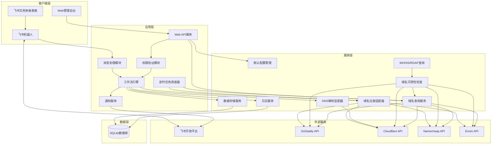
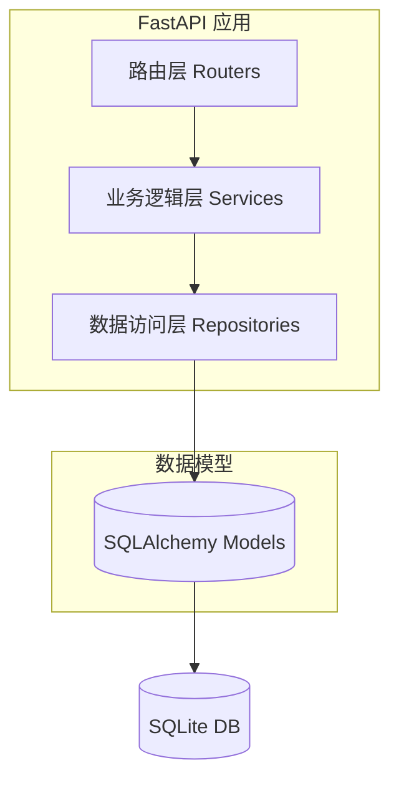
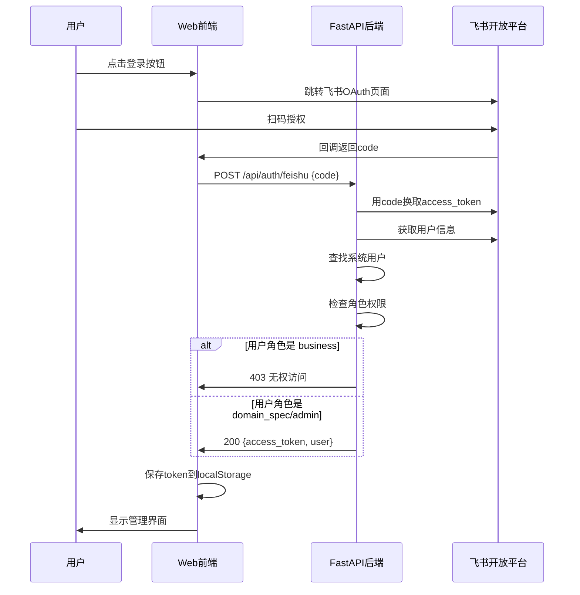

# 域名管家 - 技术架构文档

## 1. Architecture Design



## 2. Technology Description

| 层级 | 技术选型 | 说明 |
|------|----------|------|
| **前端** | React@18 + TypeScript + Tailwind CSS + Vite | Web管理后台，响应式设计 |
| **后端** | Python@3 + FastAPI + SQLAlchemy | API服务和业务逻辑 |
| **数据库** | SQLite | 轻量级，文件存储，便于备份迁移 |
| **机器人** | 飞书开放平台 API | 消息接收发送，用户交互，交互卡片 |
| **图表** | ECharts / Recharts | 数据可视化，统计报表 |
| **定时任务** | APScheduler | 域名到期检查定时任务 |

## 3. Route Definitions

| Route (前端) | Route (后端) | Purpose |
|-------|---------|---------|
| / | GET / | Dashboard 首页 |
| /requests | GET /api/requests | 申请记录列表 |
| /requests/:id | GET /api/requests/:id | 申请详情页 |
| /domains | GET /api/domains | 域名列表查询 |
| /domains/:domain | GET /api/domains/:domain | 域名详情和DNS记录查询 |
| /domains/expiring | GET /api/domains/expiring | 即将到期域名列表 |
| /statistics | GET /api/statistics | 统计报表页 |
| /logs | GET /api/logs | 操作日志页 |
| /config/registrars | GET/POST/PUT/DELETE /api/registrars | 域名商管理 |
| /config/dnsproviders | GET/POST/PUT/DELETE /api/dnsproviders | 解析商管理 |
| /config/regaccounts | GET/POST/PUT/DELETE /api/regaccounts | 域名账号管理 |
| /config/dnsaccounts | GET/POST/PUT/DELETE /api/dnsaccounts | 解析账号管理 |
| /config/users | GET/POST/PUT/DELETE /api/users | 用户管理 |
| /config/defaults | GET/PUT /api/config/defaults | 默认配置管理（注册商/解析商/账号） |
| /requests/:id/choose-registrar | POST /api/requests/:id/choose-registrar | 域名专员选择/修改注册商/账号 |
| /feishu/request | POST /api/feishu/request | 接收飞书文档表格的申请 |
| /feishu/update-table-row | POST /api/feishu/update-table-row | 更新飞书表格行状态（可选） |
| /dns/check-records | POST /api/dns/check-records | 检查域名现有解析记录，识别新增/修改 |
| /requests/:id/dns-records | GET /api/requests/:id/dns-records | 获取申请中的解析记录列表 |
| /requests/:id/approve-dns | POST /api/requests/:id/approve-dns | 一键确认并执行DNS解析申请 |

## 4. API Definitions

### 4.1 类型定义
```typescript
// 系统默认配置
interface SystemDefaults {
  default_registrar_id: number;
  default_registrar?: Registrar;
  default_reg_account_id: number;
  default_reg_account?: RegAccount;
  default_dns_provider_id: number;
  default_dns_provider?: DnsProvider;
  default_dns_account_id: number;
  default_dns_account?: DnsAccount;
  updated_at: string;
}

// 操作日志
interface AuditLog {
  id: number;
  action_type: string;
  request_id?: string;
  domain?: string;
  operator_id: string;
  operator_name: string;
  action_details?: any;
  message?: string;
  created_at: string;
}

// 申请记录
interface Request {
  id: string;
  type: 'domain_register' | 'dns_record';
  requester_id: string;
  requester_name: string;
  domain: string;
  dns_config: DNSRecord[];
  // 申请时的默认配置
  selected_registrar_id?: number;
  selected_registrar?: Registrar;
  selected_reg_account_id?: number;
  selected_reg_account?: RegAccount;
  selected_dns_provider_id?: number;
  selected_dns_provider?: DnsProvider;
  selected_dns_account_id?: number;
  selected_dns_account?: DnsAccount;
  status: 'pending_approval' | 'processing' | 'completed' | 'rejected' | 'failed';
  approval_history: ApprovalAction[];
  execution_result?: DomainRegistrationResult;
  conversation_id?: string;
  created_at: string;
  updated_at: string;
}

// 域名注册结果详细信息
interface DomainRegistrationResult {
  success: boolean;
  domain: string;
  registrar_order_id?: string;
  registration_date?: string;
  expiration_date?: string;
  // 给域名专员的额外信息
  reg_account_id?: number;
  reg_account_name?: string;
  price?: number;
  price_currency?: string;
  registrant_info?: DomainContact;
  admin_info?: DomainContact;
  tech_info?: DomainContact;
  error_message?: string;
}

// DNS记录
interface DNSRecord {
  type: 'A' | 'AAAA' | 'CNAME' | 'MX' | 'TXT' | 'SRV';
  name: string;
  value: string;
  ttl?: number;
  priority?: number;
  weight?: number;
  port?: number;
}

// DNS解析申请的单条记录
interface DNSRecordRequest {
  id?: string;
  domain: string;
  operation_type: 'add' | 'update';  // 新增或修改
  record_type: 'A' | 'AAAA' | 'CNAME' | 'MX' | 'TXT' | 'SRV';
  host: string;  // 主机记录
  value: string;  // 新值
  original_value?: string;  // 原值（修改时必填）
  ttl?: number;
  priority?: number;
  weight?: number;
  port?: number;
  identified_type?: 'add' | 'update' | 'conflict';  // 系统识别后的类型
  identified_status?: 'confirmed' | 'needs_review';  // 系统识别后的状态
  status?: 'pending' | 'success' | 'failed';  // 执行状态
  error_message?: string;
}

// DNS解析申请识别结果
interface DNSRecordIdentifyResult {
  records: DNSRecordRequest[];
  summary: {
    total: number;
    add_count: number;
    update_count: number;
    conflict_count: number;
  };
}

// DNS解析申请执行结果
interface DNSExecutionResult {
  success: boolean;
  total: number;
  success_count: number;
  failed_count: number;
  records: {
    record: DNSRecordRequest;
    status: 'success' | 'failed';
    error_message?: string;
  }[];
  execution_time: string;
}

// 审批操作
interface ApprovalAction {
  action: 'approve' | 'reject';
  user_id: string;
  comment?: string;
  timestamp: string;
}

// 统计数据
interface Statistics {
  total_requests: number;
  pending_count: number;
  completed_count: number;
  rejected_count: number;
  failed_count: number;
  requests_by_type: Record<string, number>;
  requests_by_day: { date: string; count: number }[];
}

// 日志记录
interface LogEntry {
  id: number;
  level: 'info' | 'warn' | 'error' | 'debug';
  message: string;
  context?: Record<string, any>;
  created_at: string;
}

// 域名信息（新增）
interface Domain {
  name: string;
  registrar: string;  // godaddy, cloudflare, etc.
  registration_date: string;
  expiration_date: string;
  days_until_expiry: number;
  dns_platform: string;
  dns_records: DNSRecord[];
  status: 'active' | 'expiring_soon' | 'expired';
}

// 到期提醒（新增）
interface ExpirationReminder {
  domain: string;
  expiration_date: string;
  days_remaining: number;
  urgency: 'critical' | 'warning';  // <30 days = critical, <60 days = warning
  notified_at?: string;
}

// 域名商
interface Registrar {
  id: number;
  name: string;
  code: string;
  description?: string;
  api_endpoint?: string;
  created_at: string;
  updated_at: string;
}

// 解析商
interface DnsProvider {
  id: number;
  name: string;
  code: string;
  description?: string;
  api_endpoint?: string;
  created_at: string;
  updated_at: string;
}

// 域名账号
interface RegAccount {
  id: number;
  registrar_id: number;
  registrar: Registrar;
  name: string;
  api_key: string;
  api_secret?: string;
  owner_user_id: number;  // 所属域名专员ID
  owner_user?: User;
  created_at: string;
  updated_at: string;
}

// 解析账号
interface DnsAccount {
  id: number;
  dns_provider_id: number;
  dns_provider: DnsProvider;
  name: string;
  api_key: string;
  api_secret?: string;
  created_at: string;
  updated_at: string;
}

// 用户
interface User {
  id: number;
  name: string;
  role: 'business' | 'domain_spec' | 'admin';
  feishu_userid?: string;
  feishu_unionid?: string;
  email?: string;
  phone?: string;
  permissions: string[];
  created_at: string;
  updated_at: string;
}

// 域名联系人信息
interface DomainContact {
  id: number;
  domain: string;
  type: 'registrant' | 'admin' | 'tech' | 'billing';
  name?: string;
  email?: string;
  phone?: string;
  organization?: string;
  address?: string;
  city?: string;
  state?: string;
  zip_code?: string;
  country?: string;
}

// 域名（更新）
interface Domain {
  name: string;
  registrar_id: number;
  registrar: Registrar;
  reg_account_id: number;
  reg_account: RegAccount;
  dns_provider_id: number;
  dns_provider: DnsProvider;
  dns_account_id: number;
  dns_account: DnsAccount;
  registration_date: string;
  expiration_date: string;
  days_until_expiry: number;
  contacts: DomainContact[];
  dns_records: DNSRecord[];
  status: 'active' | 'expiring_soon' | 'expired';
  created_at: string;
  updated_at: string;
}
```

### 4.2 API 接口

#### 获取申请列表
```
GET /api/requests
Query:
  - status?: string
  - start_date?: string
  - end_date?: string
  - page?: number
  - limit?: number

Response:
{
  items: Request[];
  total: number;
  page: number;
  limit: number;
}
```

#### 获取申请详情
```
GET /api/requests/:id

Response: Request
```

#### 获取统计数据
```
GET /api/statistics
Query:
  - start_date?: string
  - end_date?: string

Response: Statistics
```

#### 获取日志
```
GET /api/logs
Query:
  - level?: string
  - start_date?: string
  - end_date?: string
  - page?: number
  - limit?: number

Response:
{
  items: LogEntry[];
  total: number;
}
```

#### 获取域名列表（仅查询）
```
GET /api/domains
Query:
  - registrar?: string
  - dns_platform?: string
  - page?: number
  - limit?: number

Response:
{
  items: Domain[];
  total: number;
}
```

#### 获取域名详情和DNS记录（仅查询）
```
GET /api/domains/:domain

Response: Domain

Note: 仅返回查询结果，不提供修改或删除接口
```

#### 获取即将到期域名列表
```
GET /api/domains/expiring
Query:
  - days?: number  // 默认60天内到期的域名

Response:
{
  items: ExpirationReminder[];
  total: number;
}
```

#### 域名商管理
```
# 获取域名商列表
GET /api/registrars

# 创建域名商
POST /api/registrars
Body: { name, code, description, api_endpoint }

# 更新域名商
PUT /api/registrars/:id

# 删除域名商
DELETE /api/registrars/:id
```

#### 解析商管理
```
# 获取解析商列表
GET /api/dnsproviders

# 创建解析商
POST /api/dnsproviders
Body: { name, code, description, api_endpoint }

# 更新解析商
PUT /api/dnsproviders/:id

# 删除解析商
DELETE /api/dnsproviders/:id
```

#### 域名账号管理
```
# 获取域名账号列表
GET /api/regaccounts

# 创建域名账号
POST /api/regaccounts
Body: { registrar_id, name, api_key, api_secret, owner_user_id }

# 更新域名账号
PUT /api/regaccounts/:id

# 删除域名账号
DELETE /api/regaccounts/:id
```

#### 解析账号管理
```
# 获取解析账号列表
GET /api/dnsaccounts

# 创建解析账号
POST /api/dnsaccounts
Body: { dns_provider_id, name, api_key, api_secret }

# 更新解析账号
PUT /api/dnsaccounts/:id

# 删除解析账号
DELETE /api/dnsaccounts/:id
```

#### 用户管理
```
# 获取用户列表
GET /api/users

# 创建用户
POST /api/users
Body: { name, role, feishu_userid, feishu_unionid, email, phone, permissions }

# 更新用户
PUT /api/users/:id

# 删除用户
DELETE /api/users/:id
```

#### 默认配置管理
```
# 获取默认配置
GET /api/config/defaults
Response: SystemDefaults

# 更新默认配置
PUT /api/config/defaults
Body: { default_registrar_id, default_reg_account_id, default_dns_provider_id, default_dns_account_id }
```

#### 检查域名现有解析记录，识别新增/修改
```
POST /api/dns/check-records
Body: {
  dns_provider_id: number,
  dns_account_id: number,
  records: DNSRecordRequest[]
}
Response: DNSRecordIdentifyResult
```

#### 获取申请中的解析记录列表
```
GET /api/requests/:id/dns-records
Response: {
  request_id: string,
  records: DNSRecordRequest[],
  summary: { total: number, add_count: number, update_count: number }
}
```

#### 一键确认并执行DNS解析申请
```
POST /api/requests/:id/approve-dns
Body: {
  dns_provider_id?: number,
  dns_account_id?: number
}
Response: {
  success: boolean,
  message: string,
  execution_result?: DNSExecutionResult
}
```

#### 域名专员选择/修改注册商/账号
```
# 选择注册商和账号（飞书交互卡片回调）
POST /api/requests/:id/choose-registrar
Body: { registrar_id, reg_account_id }
Response: { success: boolean, message: string }

# 确认执行注册（飞书交互卡片回调）
POST /api/requests/:id/confirm
Body: { action: 'confirm' | 'reject' }
Response: { success: boolean, message: string }
```

#### 飞书集成API
```
# 飞书工作流回调 - 接收飞书文档表格的申请
POST /api/feishu/request
Body: {
  trigger_type: "domain_register" | "dns_record",
  requester_id: string,       // 飞书用户ID
  requester_name: string,
  domain: string,
  dns_records?: DNSRecord[],  // 解析申请时
  table_row_id?: string       // 飞书表格行ID
}
Response: {
  success: boolean,
  request_id?: string,
  message: string
}

# 更新飞书表格行状态（可选，需要飞书API权限）
POST /api/feishu/update-table-row
Body: {
  table_row_id: string,
  status: string
}
```

#### 域名可用性检查API
```
# 查询域名是否可注册
GET /api/domain/check-availability
Query: {
  domain: string,
  registrar_id?: number  // 可选，指定注册商
}
Response: {
  available: boolean,
  domain: string,
  price?: number,
  currency?: string,
  message?: string
}
```

#### Web认证API
```
# 飞书扫码登录
POST /api/auth/feishu
Body: {
  code: string  // 飞书OAuth授权码
}
Response: {
  success: boolean,
  access_token: string,
  user: User
}

# 获取当前登录用户信息
GET /api/auth/me
Headers: { Authorization: Bearer {access_token} }
Response: User

# 登出
POST /api/auth/logout
Headers: { Authorization: Bearer {access_token} }
Response: { success: boolean }
```

#### 操作记录API
```
# 获取操作日志列表
GET /api/audit-logs
Query: {
  start_date?: string,
  end_date?: string,
  action_type?: string,
  operator_id?: string,
  domain?: string,
  request_id?: string,
  page?: number,
  limit?: number
}
Response: {
  items: AuditLog[],
  total: number,
  page: number,
  limit: number
}

# 获取单个操作日志详情
GET /api/audit-logs/:id
Response: AuditLog

# 导出操作日志
GET /api/audit-logs/export
Query: {
  start_date?: string,
  end_date?: string,
  action_type?: string,
  operator_id?: string,
  domain?: string,
  request_id?: string,
  format?: "csv" | "json"
}
Response: 文件下载
```

## 5. Server Architecture Diagram



## 6. Data Model

### 6.1 设计原则
- **规范化**：遵循第三范式，避免数据冗余
- **可扩展性**：外键关联，支持无缝添加新注册商/解析商
- **安全性**：API密钥加密存储，审计日志完整
- **性能**：合理的索引设计，支持大数据量查询
- **数据完整性**：外键约束，级联规则明确

### 6.2 ER Diagram


### 6.3 Data Definition Language (SQLAlchemy)

```python
from sqlalchemy import (
    Column, String, Text, DateTime, JSON, Integer, ForeignKey, 
    Boolean, Decimal, UniqueConstraint, Index
)
from sqlalchemy.ext.declarative import declarative_base
from sqlalchemy.orm import relationship
from datetime import datetime

Base = declarative_base()

# ============================================
# 用户表
# ============================================
class User(Base):
    __tablename__ = "users"

    id = Column(Integer, primary_key=True, autoincrement=True)
    name = Column(String(100), nullable=False)
    role = Column(String(20), nullable=False)  # business, domain_spec, admin
    feishu_userid = Column(String(100), nullable=True, unique=True)
    feishu_unionid = Column(String(100), nullable=True)
    email = Column(String(255), nullable=True)
    phone = Column(String(50), nullable=True)
    permissions = Column(JSON, default=list)
    is_active = Column(Boolean, default=True, nullable=False)
    created_at = Column(DateTime, default=datetime.utcnow, nullable=False)
    updated_at = Column(DateTime, default=datetime.utcnow, onupdate=datetime.utcnow, nullable=False)

    # 关系
    reg_accounts = relationship("RegAccount", back_populates="owner_user")
    dns_accounts = relationship("DnsAccount", back_populates="owner_user")

    __table_args__ = (
        Index('idx_users_role', 'role'),
        Index('idx_users_feishu_userid', 'feishu_userid'),
    )

# ============================================
# 注册商表
# ============================================
class Registrar(Base):
    __tablename__ = "registrars"

    id = Column(Integer, primary_key=True, autoincrement=True)
    name = Column(String(100), nullable=False)
    code = Column(String(50), nullable=False, unique=True)
    description = Column(Text, nullable=True)
    api_endpoint = Column(String(500), nullable=True)
    is_active = Column(Boolean, default=True, nullable=False)
    created_at = Column(DateTime, default=datetime.utcnow, nullable=False)
    updated_at = Column(DateTime, default=datetime.utcnow, onupdate=datetime.utcnow, nullable=False)

    # 关系
    reg_accounts = relationship("RegAccount", back_populates="registrar")

    __table_args__ = (
        Index('idx_registrars_code', 'code'),
        Index('idx_registrars_is_active', 'is_active'),
    )

# ============================================
# DNS解析商表
# ============================================
class DnsProvider(Base):
    __tablename__ = "dns_providers"

    id = Column(Integer, primary_key=True, autoincrement=True)
    name = Column(String(100), nullable=False)
    code = Column(String(50), nullable=False, unique=True)
    description = Column(Text, nullable=True)
    api_endpoint = Column(String(500), nullable=True)
    is_active = Column(Boolean, default=True, nullable=False)
    created_at = Column(DateTime, default=datetime.utcnow, nullable=False)
    updated_at = Column(DateTime, default=datetime.utcnow, onupdate=datetime.utcnow, nullable=False)

    # 关系
    dns_accounts = relationship("DnsAccount", back_populates="dns_provider")

    __table_args__ = (
        Index('idx_dns_providers_code', 'code'),
        Index('idx_dns_providers_is_active', 'is_active'),
    )

# ============================================
# 注册账号表
# ============================================
class RegAccount(Base):
    __tablename__ = "reg_accounts"

    id = Column(Integer, primary_key=True, autoincrement=True)
    registrar_id = Column(Integer, ForeignKey('registrars.id'), nullable=False)
    owner_user_id = Column(Integer, ForeignKey('users.id'), nullable=False)
    name = Column(String(100), nullable=False)
    api_key_encrypted = Column(Text, nullable=False)  # 加密存储
    api_secret_encrypted = Column(Text, nullable=True)  # 加密存储
    is_active = Column(Boolean, default=True, nullable=False)
    created_at = Column(DateTime, default=datetime.utcnow, nullable=False)
    updated_at = Column(DateTime, default=datetime.utcnow, onupdate=datetime.utcnow, nullable=False)

    # 关系
    registrar = relationship("Registrar", back_populates="reg_accounts")
    owner_user = relationship("User", back_populates="reg_accounts")
    domains = relationship("Domain", back_populates="reg_account")

    __table_args__ = (
        Index('idx_reg_accounts_registrar_id', 'registrar_id'),
        Index('idx_reg_accounts_owner_user_id', 'owner_user_id'),
        Index('idx_reg_accounts_is_active', 'is_active'),
    )

# ============================================
# DNS解析账号表
# ============================================
class DnsAccount(Base):
    __tablename__ = "dns_accounts"

    id = Column(Integer, primary_key=True, autoincrement=True)
    dns_provider_id = Column(Integer, ForeignKey('dns_providers.id'), nullable=False)
    owner_user_id = Column(Integer, ForeignKey('users.id'), nullable=False)
    name = Column(String(100), nullable=False)
    api_key_encrypted = Column(Text, nullable=False)  # 加密存储
    api_secret_encrypted = Column(Text, nullable=True)  # 加密存储
    is_active = Column(Boolean, default=True, nullable=False)
    created_at = Column(DateTime, default=datetime.utcnow, nullable=False)
    updated_at = Column(DateTime, default=datetime.utcnow, onupdate=datetime.utcnow, nullable=False)

    # 关系
    dns_provider = relationship("DnsProvider", back_populates="dns_accounts")
    owner_user = relationship("User", back_populates="dns_accounts")
    domains = relationship("Domain", back_populates="dns_account")

    __table_args__ = (
        Index('idx_dns_accounts_dns_provider_id', 'dns_provider_id'),
        Index('idx_dns_accounts_owner_user_id', 'owner_user_id'),
        Index('idx_dns_accounts_is_active', 'is_active'),
    )

# ============================================
# 域名表
# ============================================
class Domain(Base):
    __tablename__ = "domains"

    name = Column(String(255), primary_key=True)
    registrar_id = Column(Integer, ForeignKey('registrars.id'), nullable=False)
    reg_account_id = Column(Integer, ForeignKey('reg_accounts.id'), nullable=False)
    dns_provider_id = Column(Integer, ForeignKey('dns_providers.id'), nullable=False)
    dns_account_id = Column(Integer, ForeignKey('dns_accounts.id'), nullable=False)
    registration_date = Column(DateTime, nullable=True)
    expiration_date = Column(DateTime, nullable=True)
    registrar_order_id = Column(String(255), nullable=True)
    price = Column(Decimal(10, 2), nullable=True)
    currency = Column(String(10), nullable=True, default='CNY')
    auto_renew = Column(Boolean, default=False, nullable=False)
    is_active = Column(Boolean, default=True, nullable=False)
    created_at = Column(DateTime, default=datetime.utcnow, nullable=False)
    updated_at = Column(DateTime, default=datetime.utcnow, onupdate=datetime.utcnow, nullable=False)

    # 关系
    registrar = relationship("Registrar")
    reg_account = relationship("RegAccount", back_populates="domains")
    dns_provider = relationship("DnsProvider")
    dns_account = relationship("DnsAccount", back_populates="domains")
    contacts = relationship("DomainContact", back_populates="domain")
    expiration_reminders = relationship("ExpirationReminder", back_populates="domain")

    __table_args__ = (
        Index('idx_domains_registrar_id', 'registrar_id'),
        Index('idx_domains_reg_account_id', 'reg_account_id'),
        Index('idx_domains_expiration_date', 'expiration_date'),
        Index('idx_domains_is_active', 'is_active'),
    )

# ============================================
# 域名联系人表
# ============================================
class DomainContact(Base):
    __tablename__ = "domain_contacts"

    id = Column(Integer, primary_key=True, autoincrement=True)
    domain = Column(String(255), ForeignKey('domains.name'), nullable=False)
    type = Column(String(20), nullable=False)  # registrant, admin, tech, billing
    name = Column(String(255), nullable=True)
    email = Column(String(255), nullable=True)
    phone = Column(String(50), nullable=True)
    organization = Column(String(255), nullable=True)
    address = Column(Text, nullable=True)
    city = Column(String(100), nullable=True)
    state = Column(String(100), nullable=True)
    zip_code = Column(String(20), nullable=True)
    country = Column(String(100), nullable=True)
    created_at = Column(DateTime, default=datetime.utcnow, nullable=False)
    updated_at = Column(DateTime, default=datetime.utcnow, onupdate=datetime.utcnow, nullable=False)

    # 关系
    domain_rel = relationship("Domain", back_populates="contacts")

    __table_args__ = (
        UniqueConstraint('domain', 'type', name='uq_domain_contact_type'),
        Index('idx_domain_contacts_domain', 'domain'),
    )

# ============================================
# 申请表
# ============================================
class Request(Base):
    __tablename__ = "requests"

    id = Column(String(36), primary_key=True)  # UUID
    type = Column(String(20), nullable=False)  # domain_register, dns_record
    requester_id = Column(Integer, ForeignKey('users.id'), nullable=False)
    requester_name = Column(String(100), nullable=False)
    domain = Column(String(255), nullable=False)
    dns_config = Column(JSON, default=list)
    selected_registrar_id = Column(Integer, ForeignKey('registrars.id'), nullable=True)
    selected_reg_account_id = Column(Integer, ForeignKey('reg_accounts.id'), nullable=True)
    selected_dns_provider_id = Column(Integer, ForeignKey('dns_providers.id'), nullable=True)
    selected_dns_account_id = Column(Integer, ForeignKey('dns_accounts.id'), nullable=True)
    status = Column(String(20), default="pending_approval", nullable=False)
    approval_history = Column(JSON, default=list)
    execution_result = Column(JSON, default=dict)
    conversation_id = Column(String(255), nullable=True)
    source = Column(String(20), nullable=True)  # feishu_bot, feishu_table, web
    feishu_table_row_id = Column(String(255), nullable=True)
    created_at = Column(DateTime, default=datetime.utcnow, nullable=False)
    updated_at = Column(DateTime, default=datetime.utcnow, onupdate=datetime.utcnow, nullable=False)

    # 关系
    requester = relationship("User")
    approval_histories = relationship("ApprovalHistory", back_populates="request")
    dns_request_records = relationship("DnsRequestRecord", back_populates="request")

    __table_args__ = (
        Index('idx_requests_type', 'type'),
        Index('idx_requests_status', 'status'),
        Index('idx_requests_domain', 'domain'),
        Index('idx_requests_requester_id', 'requester_id'),
        Index('idx_requests_created_at', 'created_at'),
    )

# ============================================
# 审批历史表
# ============================================
class ApprovalHistory(Base):
    __tablename__ = "approval_history"

    id = Column(Integer, primary_key=True, autoincrement=True)
    request_id = Column(String(36), ForeignKey('requests.id'), nullable=False)
    action = Column(String(20), nullable=False)  # approve, reject
    user_id = Column(Integer, ForeignKey('users.id'), nullable=False)
    user_name = Column(String(100), nullable=False)
    comment = Column(Text, nullable=True)
    timestamp = Column(DateTime, default=datetime.utcnow, nullable=False)

    # 关系
    request = relationship("Request", back_populates="approval_histories")
    user = relationship("User")

    __table_args__ = (
        Index('idx_approval_history_request_id', 'request_id'),
        Index('idx_approval_history_timestamp', 'timestamp'),
    )

# ============================================
# DNS申请记录表
# ============================================
class DnsRequestRecord(Base):
    __tablename__ = "dns_request_records"

    id = Column(Integer, primary_key=True, autoincrement=True)
    request_id = Column(String(36), ForeignKey('requests.id'), nullable=False)
    domain = Column(String(255), nullable=False)
    operation_type = Column(String(20), nullable=False)  # add, update, delete
    record_type = Column(String(10), nullable=False)  # A, AAAA, CNAME, MX, TXT, SRV
    host = Column(String(255), nullable=False)
    value = Column(Text, nullable=False)
    original_value = Column(Text, nullable=True)
    ttl = Column(Integer, default=300, nullable=False)
    priority = Column(Integer, nullable=True)
    weight = Column(Integer, nullable=True)
    port = Column(Integer, nullable=True)
    identified_type = Column(String(20), nullable=True)
    identified_status = Column(String(20), nullable=True)
    status = Column(String(20), default="pending", nullable=False)  # pending, success, failed
    error_message = Column(Text, nullable=True)
    created_at = Column(DateTime, default=datetime.utcnow, nullable=False)
    updated_at = Column(DateTime, default=datetime.utcnow, onupdate=datetime.utcnow, nullable=False)

    # 关系
    request = relationship("Request", back_populates="dns_request_records")

    __table_args__ = (
        Index('idx_dns_request_records_request_id', 'request_id'),
        Index('idx_dns_request_records_domain', 'domain'),
    )

# ============================================
# 审计日志表
# ============================================
class AuditLog(Base):
    __tablename__ = "audit_logs"

    id = Column(Integer, primary_key=True, autoincrement=True)
    action_type = Column(String(50), nullable=False)
    request_id = Column(String(36), ForeignKey('requests.id'), nullable=True)
    domain = Column(String(255), ForeignKey('domains.name'), nullable=True)
    operator_id = Column(String(100), nullable=False)  # user_id 或 "system"
    operator_name = Column(String(100), nullable=False)  # 用户名 或 "System"
    ip_address = Column(String(50), nullable=True)
    user_agent = Column(String(500), nullable=True)
    action_details = Column(JSON, nullable=True)
    message = Column(Text, nullable=True)
    created_at = Column(DateTime, default=datetime.utcnow, nullable=False)

    __table_args__ = (
        Index('idx_audit_logs_action_type', 'action_type'),
        Index('idx_audit_logs_domain', 'domain'),
        Index('idx_audit_logs_operator_id', 'operator_id'),
        Index('idx_audit_logs_created_at', 'created_at'),
    )

# ============================================
# 到期提醒表
# ============================================
class ExpirationReminder(Base):
    __tablename__ = "expiration_reminders"

    id = Column(Integer, primary_key=True, autoincrement=True)
    domain = Column(String(255), ForeignKey('domains.name'), nullable=False)
    days_remaining = Column(Integer, nullable=False)
    urgency = Column(String(20), nullable=False)  # warning, critical, expired
    notified_at = Column(DateTime, nullable=True)
    created_at = Column(DateTime, default=datetime.utcnow, nullable=False)

    # 关系
    domain_rel = relationship("Domain", back_populates="expiration_reminders")

    __table_args__ = (
        Index('idx_expiration_reminders_domain', 'domain'),
        Index('idx_expiration_reminders_urgency', 'urgency'),
    )

# ============================================
# 系统默认配置表
# ============================================
class SystemDefaults(Base):
    __tablename__ = "system_defaults"

    id = Column(Integer, primary_key=True, autoincrement=True)
    default_registrar_id = Column(Integer, ForeignKey('registrars.id'), nullable=True)
    default_reg_account_id = Column(Integer, ForeignKey('reg_accounts.id'), nullable=True)
    default_dns_provider_id = Column(Integer, ForeignKey('dns_providers.id'), nullable=True)
    default_dns_account_id = Column(Integer, ForeignKey('dns_accounts.id'), nullable=True)
    updated_by = Column(Integer, ForeignKey('users.id'), nullable=True)
    updated_at = Column(DateTime, default=datetime.utcnow, onupdate=datetime.utcnow, nullable=False)
```

### 6.4 数据库初始化SQL (SQLite)

```sql
-- 初始化系统默认配置
INSERT INTO registrars (name, code, description, is_active, created_at, updated_at) VALUES
('Cloudflare', 'cloudflare', 'Cloudflare Registrar & DNS', 1, CURRENT_TIMESTAMP, CURRENT_TIMESTAMP),
('GoDaddy', 'godaddy', 'GoDaddy Registrar', 1, CURRENT_TIMESTAMP, CURRENT_TIMESTAMP),
('Namecheap', 'namecheap', 'Namecheap Registrar', 1, CURRENT_TIMESTAMP, CURRENT_TIMESTAMP),
('Enom', 'enom', 'Enom Registrar', 1, CURRENT_TIMESTAMP, CURRENT_TIMESTAMP);

INSERT INTO dns_providers (name, code, description, is_active, created_at, updated_at) VALUES
('Cloudflare', 'cloudflare', 'Cloudflare DNS', 1, CURRENT_TIMESTAMP, CURRENT_TIMESTAMP);

-- 系统默认配置只有一条记录
INSERT INTO system_defaults (id, updated_at) VALUES (1, CURRENT_TIMESTAMP);
```

### 6.5 数据库设计最佳实践

#### 6.5.1 字段命名规范
- 使用 **snake_case** 命名风格
- 时间戳字段：`created_at`, `updated_at`
- 布尔字段：`is_` 前缀（如 `is_active`）
- ID字段：表名+`_id`（如 `registrar_id`）

#### 6.5.2 索引设计原则
- **主键索引**：自动创建
- **外键索引**：所有外键字段都创建索引
- **查询索引**：根据常见查询条件创建
- **唯一索引**：保证数据唯一性（如 `code` 字段）

#### 6.5.3 数据类型选择
| 数据类型 | 使用场景 | 说明 |
|---------|---------|------|
| `INTEGER PRIMARY KEY AUTOINCREMENT` | 自增主键 | SQLite自动管理 |
| `VARCHAR(n)` | 字符串 | 限制长度，避免存储浪费 |
| `TEXT` | 长文本 | 描述、JSON等 |
| `DATETIME` | 时间戳 | 存储UTC时间 |
| `BOOLEAN` | 布尔值 | SQLite用0/1存储 |
| `JSON` | 结构化数据 | SQLite 3.9+支持 |
| `DECIMAL(p,s)` | 金额 | 精确计算，避免浮点误差 |

#### 6.5.4 安全性设计
1. **API密钥加密存储**：使用AES-256-GCM加密
2. **审计日志完整**：记录所有关键操作，包含IP、User-Agent
3. **软删除**：使用 `is_active` 标记而非物理删除
4. **数据隔离**：通过 `owner_user_id` 实现多租户隔离

#### 6.5.5 数据完整性约束
- **外键约束**：确保关联数据一致性
- **唯一约束**：防止重复数据（如域名联系人类型）
- **非空约束**：必填字段不能为空
- **默认值**：合理的默认值设置

## 7. 定时任务说明

```python
# 域名到期检查定时任务（APScheduler）
from apscheduler.schedulers.asyncio import AsyncIOScheduler

def check_domain_expiration():
    """
    每天执行一次，检查所有域名的到期情况
    - 到期前60天：发送warning提醒
    - 到期前30天：发送critical提醒
    - 已到期：发送expired警告
    """
    pass
```

## 8. 核心功能实现详解

### 8.1 域名可用性检查实现

#### 8.1.1 检查策略

域名可用性检查采用三级验证策略：

1. **注册商API检查**（首选）：直接调用各注册商API
2. **WHOIS/RDAP查询**（备用）：使用公共WHOIS/RDAP服务
3. **DNS查询**（辅助）：检查NS记录是否存在

#### 8.1.2 各注册商API实现

```python
# 注册商适配器基类
class BaseRegistrarAdapter:
    def check_domain_availability(self, domain: str) -> dict:
        """检查域名可用性"""
        raise NotImplementedError

# Cloudflare 注册商适配器
class CloudflareRegistrarAdapter(BaseRegistrarAdapter):
    def check_domain_availability(self, domain: str) -> dict:
        """使用Cloudflare Registrar API检查"""
        # 调用 Cloudflare API
        # GET /accounts/{account_id}/registrar/domains/{domain}/available
        pass

# GoDaddy 注册商适配器
class GoDaddyRegistrarAdapter(BaseRegistrarAdapter):
    def check_domain_availability(self, domain: str) -> dict:
        """使用GoDaddy API检查"""
        # 调用 GoDaddy API
        # GET /v1/domains/available
        pass

# Namecheap 注册商适配器
class NamecheapRegistrarAdapter(BaseRegistrarAdapter):
    def check_domain_availability(self, domain: str) -> dict:
        """使用Namecheap API检查"""
        # 调用 Namecheap API
        pass

# Enom 注册商适配器
class EnomRegistrarAdapter(BaseRegistrarAdapter):
    def check_domain_availability(self, domain: str) -> dict:
        """使用Enom API检查"""
        # 调用 Enom API
        pass

# 统一的域名可用性检查服务（已确认方案）
class DomainAvailabilityService:
    def check_availability(self, domain: str, registrar_id: int = None) -> dict:
        """
        检查域名可用性 - 使用指定注册商或系统默认注册商
        """
        # 1. 如果指定了注册商，使用该注册商检查
        if registrar_id:
            adapter = self.get_registrar_adapter(registrar_id)
            result = adapter.check_domain_availability(domain)
            if result.get('check_successful'):
                return result
        else:
            # 2. 未指定注册商，使用系统默认配置的注册商
            defaults = SystemDefaults.objects.get_first()
            if defaults and defaults.default_registrar_id:
                adapter = self.get_registrar_adapter(defaults.default_registrar_id)
                result = adapter.check_domain_availability(domain)
                if result.get('check_successful'):
                    return result
        
        # 3. 备用：RDAP 查询（仅用于验证，不能判断可注册性）
        rdap_result = self.check_rdap(domain)
        if rdap_result:
            return rdap_result
        
        return {
            'available': None,
            'error': '无法确定域名状态'
        }
    
    def check_rdap(self, domain: str) -> dict:
        """使用 IANA 公共 RDAP 服务查询域名信息（完全免费）"""
        # 调用 https://rdap.iana.org/...
        pass
```

### 8.2 自动设置Cloudflare Nameserver实现

#### 8.2.1 注册后自动配置流程

```python
class DomainRegistrationWorkflow:
    def complete_registration(self, request_id: str):
        """
        完成域名注册后自动配置nameserver
        """
        # 1. 获取系统默认配置
        defaults = SystemDefaults.objects.get_first()
        
        # 2. 获取域名信息
        domain_info = self.get_domain_info(request_id)
        
        # 3. 通过注册商API修改nameserver
        self.set_domain_nameservers(
            domain=domain_info['name'],
            registrar_id=defaults.default_registrar_id,
            nameservers=[
                'ns1.cloudflare.com',
                'ns2.cloudflare.com',
                'ns3.cloudflare.com'
            ]
        )
        
        # 4. 记录操作日志
        self.log_operation(
            action_type='nameserver_configured',
            domain=domain_info['name'],
            message='域名nameserver已自动设置为Cloudflare'
        )
        
        # 5. 更新域名表
        self.update_domain_info(domain_info['name'], {
            'dns_provider_id': defaults.default_dns_provider_id,
            'dns_account_id': defaults.default_dns_account_id
        })
```

#### 8.2.2 Cloudflare Nameserver设置

```python
class CloudflareNameserverService:
    def set_nameservers(self, domain: str, nameservers: list):
        """
        设置域名的nameserver为Cloudflare
        """
        # 通过注册商API修改域名的nameserver
        # 各注册商API不同
        pass
```

### 8.3 权限隔离实现

#### 8.3.1 权限检查中间件

```python
# FastAPI 依赖注入的权限检查
from fastapi import Depends, HTTPException, status
from sqlalchemy.orm import Session

def get_current_user():
    """获取当前登录用户"""
    pass

def has_permission(permission: str):
    """权限装饰器"""
    def dependency(user: User = Depends(get_current_user)):
        if user.role == 'admin':
            return True
        if permission in user.permissions:
            return True
        raise HTTPException(
            status_code=status.HTTP_403_FORBIDDEN,
            detail="无权限操作"
        )
    return dependency
```

#### 8.3.2 数据隔离查询

```python
# 数据访问层 - 按用户过滤
class DomainRepository:
    def get_domains_by_user(self, db: Session, user_id: int):
        """
        获取用户有权限管理的域名
        只能看到自己账号下的域名
        """
        # 获取用户拥有的注册账号
        reg_accounts = db.query(RegAccount).filter(
            RegAccount.owner_user_id == user_id
        ).all()
        reg_account_ids = [a.id for a in reg_accounts]

        # 查询这些账号下的域名
        return db.query(Domain).filter(
            Domain.reg_account_id.in_(reg_account_ids)
        ).all()

    def get_reg_accounts_by_user(self, db: Session, user_id: int):
        """获取用户的注册账号"""
        return db.query(RegAccount).filter(
            RegAccount.owner_user_id == user_id
        ).all()

    def get_dns_accounts_by_user(self, db: Session, user_id: int):
        """获取用户的DNS账号"""
        return db.query(DnsAccount).filter(
            DnsAccount.owner_user_id == user_id
        ).all()
```

#### 8.3.3 申请分配与通知

```python
class RequestAssignmentService:
    def assign_to_domain_spec(self, request: Request):
        """
        将申请分配给域名专员
        规则：
        - 如果该域名已经存在：分配给该域名负责人
        - 如果是新域名：分配给默认配置中的注册账号负责人
        """
        # 1. 查询是否已有该域名
        existing_domain = Domain.query.filter_by(name=request.domain).first()
        
        if existing_domain:
            # 分配给该域名的注册账号所有者
            reg_account = RegAccount.query.get(existing_domain.reg_account_id)
            assignee_id = reg_account.owner_user_id
        else:
            # 使用默认配置中的账号负责人
            defaults = SystemDefaults.get_first()
            reg_account = RegAccount.query.get(defaults.default_reg_account_id)
            assignee_id = reg_account.owner_user_id
        
        # 2. 发送通知给域名专员
        self.notify_domain_spec(assignee_id, request)
        
        return assignee_id
```

### 8.4 DNS解析申请卡片显示

#### 8.4.1 飞书卡片构建

```python
class DNSRequestCardBuilder:
    def build_card(self, request: Request, dns_records: list):
        """
        构建飞书交互卡片，显示：
        - 域名
        - 注册商和注册账号
        - 解析商和解析账号
        - 解析记录（标注新增/修改）
        """
        # 获取域名现有信息
        domain_info = self.get_domain_info(request.domain)

        # 构建卡片
        card = {
            "elements": [
                {
                    "tag": "div",
                    "text": {
                        "tag": "lark_md",
                        "content": f"**域名解析申请**\n域名：{request.domain}"
                    }
                },
                {
                    "tag": "div",
                    "text": {
                        "tag": "lark_md",
                        "content": f"注册商：{domain_info['registrar_name']} | 注册账号：{domain_info['reg_account_name']}\n解析商：{domain_info['dns_provider_name']} | 解析账号：{domain_info['dns_account_name']}"
                    }
                },
                {
                    "tag": "hr"
                }
            ]
        }

        # 添加解析记录
        for record in dns_records:
            tag_color = "green" if record['operation_type'] == 'add' else "orange"
            tag_text = "新增" if record['operation_type'] == 'add' else "修改"

            record_element = {
                "tag": "div",
                "text": {
                    "tag": "lark_md",
                    "content": f"[{tag_text}] {record['record_type']} {record['host']} -> {record['value']}"
                },
                "extra": {
                    "tag": "div",
                    "text": {
                        "tag": "lark_md",
                        "content": f"[{tag_color}]"
                    }
                }
            }

            if record['operation_type'] == 'update' and record.get('original_value'):
                record_element['text']['content'] += f"\n原记录：{record['original_value']}"

            card['elements'].append(record_element)

        # 添加操作按钮
        card['elements'].extend([
            {
                "tag": "hr"
            },
            {
                "tag": "action",
                "actions": [
                    {
                        "tag": "button",
                        "text": {
                            "tag": "lark_md",
                            "content": "一键确认"
                        },
                        "type": "primary",
                        "value": {"action": "approve", "request_id": request.id},
                        "confirm": {
                            "title": {"tag": "lark_md", "content": "确认执行"},
                            "text": {"tag": "lark_md", "content": "确认要执行这些解析配置吗？"},
                            "confirm_text": "确认",
                            "cancel_text": "取消"
                        }
                    },
                    {
                        "tag": "button",
                        "text": {
                            "tag": "lark_md",
                            "content": "查看详情"
                        },
                        "type": "default",
                        "value": {"action": "view", "request_id": request.id}
                    }
                ]
            }
        ])

        return card
```

## 9. 支持的注册商和解析商

| 类型 | 平台 | 代码 | 说明 |
|------|------|------|------|
| 注册商 | Cloudflare | cloudflare | 同时作为解析商使用 |
| 注册商 | GoDaddy | godaddy | 支持域名注册 |
| 注册商 | Namecheap | namecheap | 支持域名注册 |
| 注册商 | Enom | enom | 支持域名注册 |
| 解析商 | Cloudflare | cloudflare | **唯一支持的解析商** |

## 10. 直接注册功能实现

### 10.1 权限检查服务

```python
class PermissionService:
    @staticmethod
    def can_direct_register(user: User) -> bool:
        """
        检查用户是否有权限直接注册域名（无需审批）
        """
        return user.role in ['domain_spec', 'admin']
    
    @staticmethod
    def get_user_by_feishu_user_id(feishu_user_id: str, db: Session) -> Optional[User]:
        """通过飞书用户ID查找系统用户"""
        return db.query(User).filter(
            User.feishu_user_id == feishu_user_id
        ).first()
```

### 10.2 飞书机器人直接注册入口

```python
class FeishuBotHandler:
    def handle_registration_command(self, event: dict):
        """
        处理用户直接注册域名的请求
        """
        feishu_user_id = event['sender']['sender_id']['user_id']
        
        # 1. 查询用户信息
        user = PermissionService.get_user_by_feishu_user_id(feishu_user_id)
        if not user:
            return self.reply("请先联系管理员配置您的账户信息")
        
        # 2. 检查权限
        if not PermissionService.can_direct_register(user):
            return self.reply("您没有直接注册域名的权限，请通过正常申请流程")
        
        # 3. 进入注册流程
        return self.start_registration_dialog(user)
    
    def start_registration_dialog(self, user: User):
        """启动直接注册的对话框"""
        return {
            "msg_type": "interactive",
            "card": {
                "elements": [
                    {
                        "tag": "div",
                        "text": {
                            "tag": "lark_md",
                            "content": "**域名注册（直接模式）**\n请输入想要注册的域名（例如：example.com）"
                        }
                    },
                    {
                        "tag": "input",
                        "element": {
                            "tag": "plain_text_input",
                            "action_id": "domain_input"
                        },
                        "label": {
                            "tag": "plain_text",
                            "content": "域名"
                        }
                    },
                    {
                        "tag": "action",
                        "actions": [
                            {
                                "tag": "button",
                                "text": {
                                    "tag": "plain_text",
                                    "content": "检查域名"
                                },
                                "type": "primary",
                                "value": {"action": "check_domain", "user_id": str(user.id)}
                            }
                        ]
                    }
                ]
            }
        }
```

### 10.3 直接注册流程处理

```python
class DirectRegistrationService:
    @staticmethod
    def start_check(domain: str, user: User) -> dict:
        """
        检查域名可用性并返回确认卡片
        """
        # 1. 检查域名可用性
        availability = DomainAvailabilityService.check_availability(domain)
        
        if not availability['available']:
            return {
                "status": "not_available",
                "message": f"域名 {domain} 已被注册"
            }
        
        # 2. 获取用户可用的注册账号
        available_accounts = DirectRegistrationService.get_user_reg_accounts(user)
        
        if not available_accounts:
            return {
                "status": "no_accounts",
                "message": "您没有可用的注册账号，请联系管理员"
            }
        
        # 3. 获取系统默认配置
        defaults = SystemDefaults.get_first()
        
        # 4. 返回确认卡片数据
        return {
            "status": "available",
            "domain": domain,
            "price": availability.get('price'),
            "available_accounts": available_accounts,
            "default_registrar_id": defaults.default_registrar_id,
            "default_reg_account_id": defaults.default_reg_account_id
        }
    
    @staticmethod
    def get_user_reg_accounts(user: User, db: Session):
        """获取用户有权限使用的注册账号"""
        return db.query(RegAccount).filter(
            RegAccount.owner_user_id == user.id
        ).all()
    
    @staticmethod
    def execute_registration(
        domain: str,
        registrar_id: int,
        reg_account_id: int,
        user: User,
        db: Session
    ):
        """
        执行直接注册流程
        """
        # 1. 创建申请记录
        request = Request(
            id=str(uuid.uuid4()),
            type="domain_register",
            domain=domain,
            requester_id=user.id,
            registrar_id=registrar_id,
            reg_account_id=reg_account_id,
            status="processing",  # 直接进入处理状态
            created_at=datetime.now()
        )
        db.add(request)
        
        # 2. 记录操作日志
        AuditLogService.log(
            action_type="direct_registration_started",
            user_id=user.id,
            domain=domain,
            details={
                "registrar_id": registrar_id,
                "reg_account_id": reg_account_id
            },
            db=db
        )
        
        # 3. 执行注册
        registration_result = DomainRegistrationWorkflow.execute(request)
        
        # 4. 更新记录
        if registration_result['success']:
            request.status = "completed"
        else:
            request.status = "failed"
            request.error_message = registration_result.get('error')
        
        db.commit()
        
        # 5. 发送通知
        NotificationService.send_registration_result(request, user)
        
        return registration_result
```

## 11. Web端认证与权限控制实现

### 11.1 Web登录权限矩阵

| 角色 | Web登录权限 | 说明 |
|------|------------|------|
| 业务同事 | ❌ 禁止 | 仅可通过飞书提交申请 |
| 域名专员 | ✅ 允许 | 可查看分配的域名、处理申请 |
| 系统管理员 | ✅ 允许 | 可访问所有功能 |

### 11.2 Web认证流程



### 11.3 认证中间件实现

```python
# Web认证中间件
from fastapi import Depends, HTTPException, status
from fastapi.security import HTTPBearer, HTTPAuthorizationCredentials
from jose import JWTError, jwt
from datetime import datetime, timedelta
from sqlalchemy.orm import Session

security = HTTPBearer()

# JWT配置
SECRET_KEY = "your-secret-key-here"
ALGORITHM = "HS256"
ACCESS_TOKEN_EXPIRE_MINUTES = 480  # 8小时

def create_access_token(data: dict):
    """创建JWT访问令牌"""
    to_encode = data.copy()
    expire = datetime.utcnow() + timedelta(minutes=ACCESS_TOKEN_EXPIRE_MINUTES)
    to_encode.update({"exp": expire})
    encoded_jwt = jwt.encode(to_encode, SECRET_KEY, algorithm=ALGORITHM)
    return encoded_jwt

async def get_current_user(
    credentials: HTTPAuthorizationCredentials = Depends(security),
    db: Session = Depends(get_db)
) -> User:
    """获取当前登录用户并验证权限"""
    credentials_exception = HTTPException(
        status_code=status.HTTP_401_UNAUTHORIZED,
        detail="无效的认证凭证",
        headers={"WWW-Authenticate": "Bearer"},
    )
    
    try:
        payload = jwt.decode(credentials.credentials, SECRET_KEY, algorithms=[ALGORITHM])
        user_id: str = payload.get("sub")
        if user_id is None:
            raise credentials_exception
    except JWTError:
        raise credentials_exception
    
    user = db.query(User).filter(User.id == int(user_id)).first()
    if user is None:
        raise credentials_exception
    
    # 检查是否有Web访问权限
    if user.role == "business":
        raise HTTPException(
            status_code=status.HTTP_403_FORBIDDEN,
            detail="业务同事无权访问Web管理后台"
        )
    
    return user

async def get_current_active_user(
    current_user: User = Depends(get_current_user)
) -> User:
    """获取当前活跃用户"""
    return current_user

def require_admin(user: User = Depends(get_current_user)) -> User:
    """需要管理员权限"""
    if user.role != "admin":
        raise HTTPException(
            status_code=status.HTTP_403_FORBIDDEN,
            detail="需要管理员权限"
        )
    return user
```

### 11.4 Web路由访问控制

```python
# Web API路由权限配置示例
from fastapi import APIRouter, Depends

router = APIRouter(prefix="/api")

@router.get("/dashboard")
async def get_dashboard(
    current_user: User = Depends(get_current_active_user)
):
    """仪表盘 - 域名专员和管理员均可访问"""
    # 根据用户角色返回不同的数据
    if current_user.role == "admin":
        return {"data": "管理员仪表盘数据"}
    else:
        return {"data": "域名专员仪表盘数据"}

@router.get("/config/registrars")
async def get_registrars(
    current_user: User = Depends(get_current_active_user)
):
    """注册商列表 - 域名专员和管理员均可访问"""
    pass

@router.post("/config/registrars")
async def create_registrar(
    current_user: User = Depends(require_admin)
):
    """创建注册商 - 仅管理员可访问"""
    pass
```

### 11.5 前端路由守卫

```typescript
// 前端路由守卫示例（React Router）
import { Navigate } from 'react-router-dom';

interface ProtectedRouteProps {
  children: React.ReactNode;
  requiredRole?: 'admin' | 'domain_spec';
}

export function ProtectedRoute({ children, requiredRole }: ProtectedRouteProps) {
  const { user, isAuthenticated } = useAuth();

  // 检查是否已登录
  if (!isAuthenticated) {
    return <Navigate to="/login" replace />;
  }

  // 检查角色是否有访问权限（业务同事禁止）
  if (user?.role === 'business') {
    return <Navigate to="/forbidden" replace />;
  }

  // 如果需要特定角色
  if (requiredRole && user?.role !== requiredRole) {
    return <Navigate to="/forbidden" replace />;
  }

  return <>{children}</>;
}

// 路由配置
const router = createBrowserRouter([
  {
    path: '/login',
    element: <LoginPage />,
  },
  {
    path: '/',
    element: (
      <ProtectedRoute>
        <DashboardPage />
      </ProtectedRoute>
    ),
  },
  {
    path: '/config',
    element: (
      <ProtectedRoute requiredRole="admin">
        <ConfigPage />
      </ProtectedRoute>
    ),
  },
  {
    path: '/forbidden',
    element: <ForbiddenPage />,
  },
]);
```

### 11.6 Web登录页面设计

```typescript
// 飞书登录组件
export function FeishuLoginButton() {
  const feishuAuthUrl = `https://open.feishu.cn/open-apis/authen/v1/index?app_id=${FEISHU_APP_ID}&redirect_uri=${encodeURIComponent(FEISHU_REDIRECT_URI)}&state=${generateState()}`;

  return (
    <a href={feishuAuthUrl} className="feishu-login-btn">
      <FeishuIcon />
      飞书扫码登录
    </a>
  );
}

// 登录页面
export function LoginPage() {
  const [error, setError] = useState<string | null>(null);
  const location = useLocation();
  const navigate = useNavigate();

  const handleFeishuCallback = async (code: string) => {
    try {
      const response = await authApi.feishuLogin({ code });
      if (response.success) {
        localStorage.setItem('access_token', response.access_token);
        localStorage.setItem('user', JSON.stringify(response.user));
        
        const from = (location.state as any)?.from?.pathname || '/';
        navigate(from, { replace: true });
      }
    } catch (err: any) {
      if (err.status === 403) {
        setError('您无权访问Web管理后台，请联系管理员');
      } else {
        setError('登录失败，请重试');
      }
    }
  };

  return (
    <div className="login-container">
      <div className="login-card">
        <h1>域名管理系统</h1>
        <p className="subtitle">仅域名专员和管理员可登录</p>
        
        {error && <div className="error-message">{error}</div>}
        
        <FeishuLoginButton />
      </div>
    </div>
  );
}
```

## 12. 可扩展性设计

### 12.1 注册商适配器扩展

#### 12.1.1 注册商适配器基类完整接口

```python
from abc import ABC, abstractmethod
from typing import Dict, Optional, List

class BaseRegistrarAdapter(ABC):
    """注册商适配器基类 - 所有注册商适配器必须实现这些接口"""
    
    @abstractmethod
    def __init__(self, api_key: str, api_secret: Optional[str] = None, **kwargs):
        """初始化适配器，传入API凭证"""
        self.api_key = api_key
        self.api_secret = api_secret
    
    @abstractmethod
    def check_domain_availability(self, domain: str) -> Dict:
        """
        检查域名可用性
        
        返回格式:
        {
            "available": bool,
            "check_successful": bool,
            "price": Optional[float],
            "currency": Optional[str],
            "error": Optional[str]
        }
        """
        pass
    
    @abstractmethod
    def register_domain(
        self,
        domain: str,
        registrant: Dict,
        admin: Dict,
        tech: Dict,
        billing: Dict,
        nameservers: List[str]
    ) -> Dict:
        """
        注册域名
        
        返回格式:
        {
            "success": bool,
            "domain": str,
            "order_id": Optional[str],
            "registration_date": Optional[str],
            "expiration_date": Optional[str],
            "error": Optional[str]
        }
        """
        pass
    
    @abstractmethod
    def get_domain_info(self, domain: str) -> Dict:
        """获取域名详细信息"""
        pass
    
    @abstractmethod
    def set_domain_nameservers(self, domain: str, nameservers: List[str]) -> Dict:
        """设置域名的Nameserver"""
        pass
    
    @abstractmethod
    def get_domain_nameservers(self, domain: str) -> List[str]:
        """获取域名当前的Nameserver"""
        pass
```

#### 12.1.2 注册商适配器工厂

```python
class RegistrarAdapterFactory:
    """注册商适配器工厂 - 用于创建适配器实例"""
    
    _adapters = {}
    
    @classmethod
    def register_adapter(cls, registrar_code: str, adapter_class):
        """注册新的注册商适配器"""
        cls._adapters[registrar_code] = adapter_class
    
    @classmethod
    def get_adapter(cls, registrar_code: str, api_key: str, api_secret: Optional[str] = None):
        """
        获取注册商适配器实例
        
        Args:
            registrar_code: 注册商代码 (cloudflare, godaddy, namecheap, enom, ...)
            api_key: API Key
            api_secret: API Secret (可选)
        
        Returns:
            BaseRegistrarAdapter 实例
        """
        adapter_class = cls._adapters.get(registrar_code)
        if not adapter_class:
            raise ValueError(f"未找到注册商 {registrar_code} 的适配器")
        
        return adapter_class(api_key, api_secret)
    
    @classmethod
    def get_supported_registrars(cls) -> List[str]:
        """获取所有支持的注册商列表"""
        return list(cls._adapters.keys())
```

#### 12.1.3 添加新注册商的步骤

**步骤1：创建适配器类**
```python
# app/adapters/registrars/new_registrar_adapter.py

from .base import BaseRegistrarAdapter

class NewRegistrarAdapter(BaseRegistrarAdapter):
    """新注册商适配器"""
    
    def __init__(self, api_key: str, api_secret: Optional[str] = None):
        super().__init__(api_key, api_secret)
        self.api_endpoint = "https://api.newregistrar.com"
    
    def check_domain_availability(self, domain: str) -> Dict:
        # 实现新注册商的域名检查逻辑
        pass
    
    def register_domain(self, domain: str, registrant, admin, tech, billing, nameservers) -> Dict:
        # 实现新注册商的域名注册逻辑
        pass
    
    # 实现其他必需方法...
```

**步骤2：在工厂中注册适配器**
```python
# app/adapters/__init__.py

from .base import BaseRegistrarAdapter
from .registrar_adapter_factory import RegistrarAdapterFactory
from .cloudflare_adapter import CloudflareRegistrarAdapter
from .godaddy_adapter import GoDaddyRegistrarAdapter
from .namecheap_adapter import NamecheapRegistrarAdapter
from .enom_adapter import EnomRegistrarAdapter
# 导入新注册商适配器
from .new_registrar_adapter import NewRegistrarAdapter

# 注册所有适配器
RegistrarAdapterFactory.register_adapter("cloudflare", CloudflareRegistrarAdapter)
RegistrarAdapterFactory.register_adapter("godaddy", GoDaddyRegistrarAdapter)
RegistrarAdapterFactory.register_adapter("namecheap", NamecheapRegistrarAdapter)
RegistrarAdapterFactory.register_adapter("enom", EnomRegistrarAdapter)
# 注册新注册商
RegistrarAdapterFactory.register_adapter("newregistrar", NewRegistrarAdapter)
```

**步骤3：在数据库中添加注册商记录**
```sql
INSERT INTO registrars (name, code, description, api_endpoint, created_at, updated_at)
VALUES (
    'New Registrar',
    'newregistrar',
    '新注册商描述',
    'https://api.newregistrar.com',
    datetime('now'),
    datetime('now')
);
```

**步骤4：配置界面自动适配**
- Web管理后台的注册商配置页面会自动从数据库读取注册商列表
- 新增的注册商将自动显示在配置界面和选择界面

### 12.2 解析商适配器扩展

#### 12.2.1 解析商适配器基类完整接口

```python
from abc import ABC, abstractmethod
from typing import Dict, List, Optional

class DNSRecord:
    """DNS记录模型"""
    def __init__(self, type: str, name: str, value: str, ttl: int = 300, priority: Optional[int] = None):
        self.type = type  # A, AAAA, CNAME, MX, TXT, SRV, etc.
        self.name = name
        self.value = value
        self.ttl = ttl
        self.priority = priority

class BaseDnsProviderAdapter(ABC):
    """DNS解析商适配器基类 - 所有解析商适配器必须实现这些接口"""
    
    @abstractmethod
    def __init__(self, api_key: str, api_secret: Optional[str] = None, **kwargs):
        """初始化适配器，传入API凭证"""
        self.api_key = api_key
        self.api_secret = api_secret
    
    @abstractmethod
    def add_domain(self, domain: str) -> Dict:
        """添加域名到DNS服务商"""
        pass
    
    @abstractmethod
    def remove_domain(self, domain: str) -> Dict:
        """从DNS服务商移除域名"""
        pass
    
    @abstractmethod
    def get_records(self, domain: str) -> List[DNSRecord]:
        """获取域名的所有DNS记录"""
        pass
    
    @abstractmethod
    def add_record(self, domain: str, record: DNSRecord) -> Dict:
        """添加DNS记录"""
        pass
    
    @abstractmethod
    def update_record(self, domain: str, record_id: str, record: DNSRecord) -> Dict:
        """更新DNS记录"""
        pass
    
    @abstractmethod
    def delete_record(self, domain: str, record_id: str) -> Dict:
        """删除DNS记录"""
        pass
    
    @abstractmethod
    def get_nameservers(self, domain: str) -> List[str]:
        """获取DNS服务商分配的Nameserver"""
        pass
```

#### 12.2.2 解析商适配器工厂

```python
class DnsProviderAdapterFactory:
    """DNS解析商适配器工厂"""
    
    _adapters = {}
    
    @classmethod
    def register_adapter(cls, provider_code: str, adapter_class):
        """注册新的DNS解析商适配器"""
        cls._adapters[provider_code] = adapter_class
    
    @classmethod
    def get_adapter(cls, provider_code: str, api_key: str, api_secret: Optional[str] = None):
        """获取DNS解析商适配器实例"""
        adapter_class = cls._adapters.get(provider_code)
        if not adapter_class:
            raise ValueError(f"未找到DNS解析商 {provider_code} 的适配器")
        
        return adapter_class(api_key, api_secret)
    
    @classmethod
    def get_supported_providers(cls) -> List[str]:
        """获取所有支持的DNS解析商列表"""
        return list(cls._adapters.keys())
```

#### 12.2.3 添加新解析商的步骤

**步骤1：创建适配器类**
```python
# app/adapters/dns/new_dns_adapter.py

from .base import BaseDnsProviderAdapter, DNSRecord

class NewDnsProviderAdapter(BaseDnsProviderAdapter):
    """新DNS解析商适配器"""
    
    def __init__(self, api_key: str, api_secret: Optional[str] = None):
        super().__init__(api_key, api_secret)
        self.api_endpoint = "https://api.newdns.com"
    
    def add_domain(self, domain: str) -> Dict:
        # 实现添加域名逻辑
        pass
    
    def get_records(self, domain: str) -> List[DNSRecord]:
        # 实现获取记录逻辑
        pass
    
    # 实现其他必需方法...
```

**步骤2：在工厂中注册适配器**
```python
# app/adapters/__init__.py

from .dns.base import BaseDnsProviderAdapter
from .dns.dns_adapter_factory import DnsProviderAdapterFactory
from .dns.cloudflare_dns_adapter import CloudflareDnsProviderAdapter
# 导入新DNS适配器
from .dns.new_dns_adapter import NewDnsProviderAdapter

# 注册所有DNS适配器
DnsProviderAdapterFactory.register_adapter("cloudflare", CloudflareDnsProviderAdapter)
# 注册新DNS解析商
DnsProviderAdapterFactory.register_adapter("newdns", NewDnsProviderAdapter)
```

**步骤3：在数据库中添加解析商记录**
```sql
INSERT INTO dns_providers (name, code, description, api_endpoint, created_at, updated_at)
VALUES (
    'New DNS Provider',
    'newdns',
    '新DNS解析商描述',
    'https://api.newdns.com',
    datetime('now'),
    datetime('now')
);
```

### 12.3 目录结构设计

```
app/
├── adapters/
│   ├── __init__.py
│   ├── base.py                          # 适配器基类
│   ├── registrar_adapter_factory.py    # 注册商工厂
│   ├── dns_adapter_factory.py          # DNS解析商工厂
│   ├── registrars/
│   │   ├── __init__.py
│   │   ├── cloudflare_adapter.py
│   │   ├── godaddy_adapter.py
│   │   ├── namecheap_adapter.py
│   │   ├── enom_adapter.py
│   │   └── [新注册商]_adapter.py      # 新增在此
│   └── dns/
│       ├── __init__.py
│       ├── base.py
│       ├── cloudflare_dns_adapter.py
│       └── [新解析商]_adapter.py       # 新增在此
├── services/
│   ├── domain_availability_service.py
│   ├── domain_registration_service.py
│   └── dns_management_service.py
└── ...
```

### 12.4 数据库设计的扩展性

所有与注册商、解析商相关的数据都通过外键关联，无需修改表结构即可扩展：

- `registrars` 表：存储注册商基本信息，通过 `code` 字段关联适配器
- `dns_providers` 表：存储DNS解析商基本信息
- `reg_accounts` 表：存储注册账号，通过 `registrar_id` 关联
- `dns_accounts` 表：存储DNS账号，通过 `dns_provider_id` 关联
- `domains` 表：记录域名所属的注册商和解析商

### 12.5 前端界面的自动适配

前端采用动态组件加载机制：

1. **配置表单组件**：根据注册商/解析商的类型动态加载对应的配置表单
2. **选择器组件**：从API获取支持的注册商/解析商列表，自动更新下拉选项
3. **权限控制**：根据用户角色动态显示可操作的注册商账号

```typescript
// 前端动态加载组件示例
const RegistrarConfig = ({ registrarCode }: { registrarCode: string }) => {
  const ConfigComponent = useMemo(() => {
    switch (registrarCode) {
      case 'cloudflare':
        return CloudflareConfig;
      case 'godaddy':
        return GoDaddyConfig;
      case 'namecheap':
        return NamecheapConfig;
      case 'enom':
        return EnomConfig;
      // 新注册商只需添加case
      case 'newregistrar':
        return NewRegistrarConfig;
      default:
        return DefaultConfig;
    }
  }, [registrarCode]);

  return <ConfigComponent />;
};
```

### 12.6 配置文件化扩展

使用配置文件定义适配器映射，无需修改代码：

```yaml
# config/registrars.yaml
registrars:
  cloudflare:
    adapter: app.adapters.registrars.cloudflare_adapter.CloudflareRegistrarAdapter
    enabled: true
  godaddy:
    adapter: app.adapters.registrars.godaddy_adapter.GoDaddyRegistrarAdapter
    enabled: true
  namecheap:
    adapter: app.adapters.registrars.namecheap_adapter.NamecheapRegistrarAdapter
    enabled: true
  enom:
    adapter: app.adapters.registrars.enom_adapter.EnomRegistrarAdapter
    enabled: true
  # 新增注册商只需添加配置
  newregistrar:
    adapter: app.adapters.registrars.new_registrar_adapter.NewRegistrarAdapter
    enabled: true

dns_providers:
  cloudflare:
    adapter: app.adapters.dns.cloudflare_dns_adapter.CloudflareDnsProviderAdapter
    enabled: true
```

### 12.7 扩展检查清单

添加新注册商/解析商时的检查清单：

- [ ] 创建适配器类，实现基类所有抽象方法
- [ ] 编写单元测试覆盖主要功能
- [ ] 在工厂中注册适配器
- [ ] 在数据库中添加对应的注册商/解析商记录
- [ ] 更新前端配置组件（如需要特殊配置）
- [ ] 更新文档
- [ ] 进行集成测试

这样的设计确保了系统具有高度的可扩展性，添加新的注册商或解析商只需按照规范实现适配器并注册即可。


