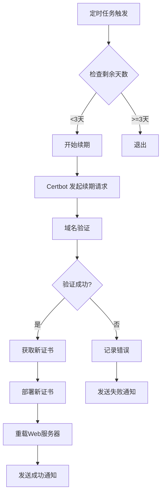

# SSL证书管理文档（系统部署域名）

## 概述

本文档详细解释**域名管家系统自身部署域名**的SSL证书管理，包括证书获取、存储、监控和自动续期。

> ⚠️ **重要说明**：本SSL证书管理功能针对系统本身的Web访问域名（例如 `d.fwxg.com`），**不是**用于管理系统所管理的业务域名的SSL证书。

---

## 1. SSL证书基础知识

### 1.1 什么是SSL/TLS证书？

SSL/TLS证书是由受信任的证书颁发机构（CA）签发的数字证书，用于：
- 验证网站身份
- 加密浏览器与服务器之间的通信
- 确保数据完整性

### 1.2 证书类型

| 类型 | 说明 | 适用场景 |
|------|------|---------|
| DV (Domain Validation) | 仅验证域名所有权 | 个人网站、博客 |
| OV (Organization Validation) | 验证域名和组织身份 | 企业网站 |
| EV (Extended Validation) | 最高级别的验证 | 电商、银行 |
| Wildcard | 支持多个子域名 | *.example.com |

### 1.3 证书结构

一个SSL证书通常包含：
- 公钥
- 域名信息
- 证书颁发机构（CA）信息
- 有效期
- CA的数字签名

---

## 2. 证书获取原理（ACME协议）

### 2.1 ACME协议简介

**ACME**（Automated Certificate Management Environment）是Let's Encrypt创建的开放协议，用于自动化证书管理。

### 2.2 域名验证方式

#### HTTP-01验证

**原理：**
```
1. Let's Encrypt 服务器向域名 http://d.fwxg.com/.well-known/acme-challenge/xxx
   发送HTTP GET请求
2. 您的服务器返回验证文件内容
3. 验证通过后颁发证书
```

**优点：**
- 配置简单
- 适用于大多数情况

**缺点：**
- 需要HTTP端口80开放
- 不支持通配符证书

#### DNS-01验证

**原理：**
```
1. Let's Encrypt 服务器查询域名的DNS TXT记录
2. 您需要在DNS中添加特定的TXT记录
3. 验证通过后颁发证书
```

**优点：**
- 支持通配符证书
- 不需要开放端口
- 适用于服务器在防火墙后的情况

**缺点：**
- 需要DNS API权限
- DNS传播需要时间

---

## 3. 域名管家的SSL证书管理架构

### 3.1 组件架构

```
┌─────────────────────────────────────────────────────────────┐
│                      域名管家系统                             │
├─────────────────────────────────────────────────────────────┤
│  ┌─────────────────┐  ┌──────────────────┐  ┌─────────────┐ │
│  │ SSL 服务模块    │  │ 定时任务调度器   │  │ 告警模块    │ │
│  └────────┬────────┘  └────────┬─────────┘  └──────┬──────┘ │
│           │                    │                   │         │
│  ┌────────▼────────┐  ┌────────▼─────────┐  ┌─────▼──────┐ │
│  │ Certbot 集成    │  │ 证书检查任务     │  │ 飞书通知    │ │
│  └────────┬────────┘  └────────┬─────────┘  └────────────┘ │
└───────────┼────────────────────┼────────────────────────────┘
            │                    │
    ┌───────▼────────┐   ┌───────▼──────────┐
    │  Certbot       │   │  SSL 证书存储    │
    │  (ACME 客户端)  │   │  /etc/letsencrypt│
    └────────────────┘   └──────────────────┘
            │
    ┌───────▼──────────┐
    │ Let's Encrypt    │
    │ (ACME Server)    │
    └──────────────────┘
```

### 3.2 证书存储结构

```
/etc/letsencrypt/
├── live/
│   └── d.fwxg.com/
│       ├── fullchain.pem      # 证书链
│       ├── privkey.pem        # 私钥
│       ├── cert.pem           # 证书
│       └── chain.pem          # 中间证书
├── archive/
│   └── d.fwxg.com/            # 证书历史版本
└── renewal/
    └── d.fwxg.com.conf        # 续期配置
```

---

## 4. 证书监控和到期检查原理

### 4.1 证书信息解析

**使用OpenSSL解析证书：**

```bash
# 读取证书信息
openssl x509 -in /etc/letsencrypt/live/d.fwxg.com/fullchain.pem -text -noout
```

**解析出的关键信息：**
- `Not Before`：证书生效时间
- `Not After`：证书到期时间
- `Issuer`：签发者
- `Subject`：主题（域名）
- `SAN`：Subject Alternative Names（所有支持的域名）

### 4.2 到期检查算法

```python
def check_certificate_expiry(cert_path):
    # 1. 读取并解析证书
    cert = parse_certificate(cert_path)

    # 2. 计算剩余天数
    expiry_date = cert.not_after
    days_remaining = (expiry_date - datetime.now()).days

    # 3. 判断告警级别
    if days_remaining <= 0:
        return "EXPIRED"
    elif days_remaining <= 7:
        return "CRITICAL"
    elif days_remaining <= 30:
        return "WARNING"
    else:
        return "OK"
```

### 4.3 定时检查任务

**推荐的检查频率：**

| 状态 | 检查频率 | 告警方式 |
|------|---------|---------|
| 正常 (30+天) | 每日一次 | 无 |
| 警告 (30-7天) | 每日一次 | 飞书通知 |
| 紧急 (<7天) | 每4小时一次 | 飞书通知 + 自动续期尝试 |
| 已过期 | 每小时一次 | 飞书紧急通知 |

---

## 5. 自动续期原理

### 5.1 续期流程



### 5.2 Certbot续期命令

```bash
# 续期所有即将到期的证书
certbot renew

# 强制续期指定域名
certbot renew --cert-name d.fwxg.com --force-renewal

# 非交互式续期
certbot renew --non-interactive --quiet
```

### 5.3 续期钩子（Hook）

**部署后钩子（Post-Hook）：**

```bash
# /etc/letsencrypt/renewal-hooks/post/reload-nginx.sh
#!/bin/bash
docker-compose reload nginx
```

---

## 6. 证书部署原理

### 6.1 Nginx配置

```nginx
server {
    listen 443 ssl http2;
    listen [::]:443 ssl http2;

    server_name d.fwxg.com;

    # SSL证书配置
    ssl_certificate /etc/letsencrypt/live/d.fwxg.com/fullchain.pem;
    ssl_certificate_key /etc/letsencrypt/live/d.fwxg.com/privkey.pem;

    # SSL安全配置
    ssl_protocols TLSv1.2 TLSv1.3;
    ssl_ciphers HIGH:!aNULL:!MD5;
    ssl_prefer_server_ciphers on;

    # HSTS
    add_header Strict-Transport-Security "max-age=31536000" always;

    # 其他配置...
}
```

### 6.2 证书热重载

**原理：**
- Nginx支持配置重载而不中断服务
- 使用`docker-compose reload nginx`或`nginx -s reload`
- 新证书立即生效，连接保持

---

## 7. 安全最佳实践

### 7.1 证书权限

```bash
# 设置正确的证书权限
chmod 600 /etc/letsencrypt/archive/d.fwxg.com/privkey*.pem
chmod 644 /etc/letsencrypt/archive/d.fwxg.com/fullchain*.pem
```

### 7.2 证书轮换

- 提前1-2周续期证书
- 保留旧证书一段时间（用于历史连接）
- 续期后立即更新证书链

### 7.3 审计

- 记录所有证书续期操作
- 监控证书颁发日志
- 定期审查证书列表

---

## 8. 常见问题排查

### 8.1 证书续期失败

**可能原因：**
1. 域名解析问题
2. HTTP-01验证失败
3. API限制（Rate Limit）
4. 权限问题

**排查步骤：**
1. 检查域名是否可访问
2. 查看Certbot日志：`/var/log/letsencrypt/`
3. 检查证书权限
4. 确认Let's Encrypt服务状态

### 8.2 证书不被信任

**可能原因：**
1. 证书链不完整
2. 使用了自签名证书
3. 证书已过期
4. 时间不同步

---

## 9. 相关文件

- `backend/app/services/ssl_service.py` - SSL服务实现
- `backend/scripts/ssl_manager.py` - SSL管理脚本
- `docs/deployment.md` - 部署文档中的SSL配置部分
