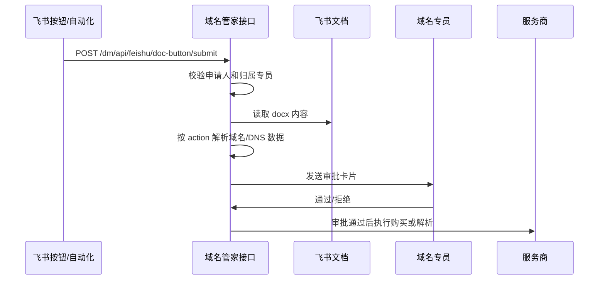

# 飞书文档集成方案（确认版）

> 版本：v1.1  
> 更新日期：2026-05-31  
> 状态：✅ 设计已全部确认，后端部分已实现，待补完  
> 替代：PRD §5（旧版飞书工作流方案已废弃）

---

## 0. 核心原则

1. **飞书文档是主申请入口**，飞书机器人为备用入口
2. **文档表格纯输入，无状态追踪** —— 表格只记录"我想要的配置"，进度不回写
3. **所有容错在后端** —— 幂等判断、重复检测、可用性检查均由服务端负责
4. **写一次** —— 业务同事在 Bitable 填完记录，点一次按钮，在确认页填域名，完成
5. **文档可自由复制** —— 新域名直接复制文档，无需管理员介入，业务同事自助完成

---

## 1. 飞书文档结构

一个飞书文档对应一个域名。文档可以以已有域名文档为模板复制，复用按钮和表格结构。

```
飞书文档（大文档，域名章节为其中一节）
│
└── 二、域名购买/解析
    │
    ├── 域名购买
    │     [申请注册域名] 按钮
    │     （无 Bitable，域名在确认页填写）
    │
    ├── CF域名解析
    │     [申请CF域名跳转解析] 按钮
    │     └── 多维表格：Hostname | Type | Target
    │
    ├── Vercel域名解析
    │     [申请Vercel域名解析] 按钮
    │     └── 多维表格：Hostname | Type | Target
    │
    ├── Clerk域名解析
    │     [申请Clerk域名解析] 按钮
    │     └── 多维表格：Hostname | Type | Target
    │
    ├── GSC网站认证解析
    │     [申请GSC认证解析] 按钮
    │     └── 多维表格：Hostname | Type | Target
    │
    ├── 接口域名解析
    │     [申请接口域名解析] 按钮
    │     └── 多维表格：Hostname | Type | Target
    │
    └── 网站邮箱支持解析
          [申请邮箱映射] 按钮
          └── 多维表格：Hostname | Type | Target
```

> **域名注册**无需 Bitable，域名在确认页输入一次即可。
> DNS 类申请均有 Bitable，用户填好记录后点按钮批量提交。

---

## 2. 按钮类型与 URL 设计

### 2.1 按钮类型

飞书文档级别的**"打开超链接"按钮**，点击在浏览器中打开我们的确认页面。

### 2.2 按钮 URL 格式

**所有按钮 URL 只含 section 标识，不含域名、不含 Bitable ID：**

```
https://{our-domain}/feishu/confirm-request?section=vercel
https://{our-domain}/feishu/confirm-request?section=clerk
https://{our-domain}/feishu/confirm-request?section=domain_register
https://{our-domain}/feishu/confirm-request?section=cf_redirect
...
```

- 复制文档后按钮 URL 不需要修改，直接可用
- 域名由用户在确认页填写
- Bitable 绑定首次自助完成，之后自动匹配

---

## 3. 确认页交互设计

### 3.1 常规使用（已绑定 Bitable）

```
┌──────────────────────────────────────┐
│  申请 Vercel 域名解析                 │
│                                      │
│  域名：[newdomain.com      ]          │  ← 用户填写，唯一需要输入的信息
│                                      │
│  待配置记录（读自下方多维表格）：      │
│  • www   CNAME → e8b247f5...         │
│  • @     CNAME → e8b247f5...         │
│                                      │
│       [确认提交]   [取消]             │
└──────────────────────────────────────┘
```

### 3.2 首次使用新文档（Bitable 未绑定）

```
┌──────────────────────────────────────┐
│  申请 Vercel 域名解析                 │
│                                      │
│  域名：[newdomain.com      ]          │
│                                      │
│  首次使用，请绑定多维表格：           │
│  在飞书文档中将对应表格新页面打开，   │
│  粘贴地址栏 URL：                     │
│  [___________________________]        │
│                                      │
│       [确认提交]   [取消]             │
└──────────────────────────────────────┘
```

绑定后系统保存 `(section, feishu_user_id) → (app_token, table_id)`，
下次同一用户点击同一 section 按钮，自动加载 Bitable 数据，无需重复操作。

> **说明**：同一 section 可能被不同用户绑定不同 Bitable（各人管理自己的域名文档），
> 因此映射以 `(section, user_id)` 为 key，而非全局共享。

### 3.3 域名注册（无 Bitable）

```
┌──────────────────────────────────────┐
│  申请注册域名                         │
│                                      │
│  域名：[newdomain.com      ]          │
│                                      │
│       [确认提交]   [取消]             │
└──────────────────────────────────────┘
```

---

## 4. 完整触发链路

```
用户在 Bitable 填好 DNS 记录（或无需填，如域名注册）
        ↓
点击文档中的"申请XXX"按钮
        ↓
浏览器打开确认页（需飞书 OAuth 登录，验证身份和申请权限）
  ├── 验证用户存在且 is_active
  ├── 验证用户有 assigned_specialist_id（业务同事必须归属专员）
  ├── 首次使用：引导绑定 Bitable
  └── 展示待提交记录摘要
        ↓
用户填写域名 + 点"确认提交"
        ↓
POST /api/v1/feishu/confirm-request
  ├── 读取 Bitable 所有记录（调飞书 Bitable API）
  ├── 过滤空行
  └── 后端幂等判断（见第5节）
        ↓
创建申请记录（source=feishu_doc）
        ↓
向归属专员发飞书审批卡片
        ↓
专员点"批准" → 执行 → 差异化通知（专员看详情，业务同事看结果）
```

---

## 5. 后端容错与幂等处理

### 5.1 域名注册

| 情况 | 处理 |
|------|------|
| 域名在注册商 API 查询不可注册 | 拒绝，告知域名已被占用 |
| 域名已在系统中有记录 | 拒绝，告知已注册 |
| 该域名已有 pending 申请 | 拒绝，告知有待审批申请，避免重复 |
| 正常 | 创建申请，通知专员 |

### 5.2 DNS 解析（每条记录独立判断）

| 情况 | 处理 |
|------|------|
| 记录不存在 | 新增 |
| 记录存在，值完全一致 | 跳过（幂等，无需操作） |
| 记录存在，值不同 | 修改 |

批量提交时逐条处理，部分跳过不影响其他条。执行结果逐条返回给专员。

---

## 6. 数据库设计

### 6.1 Bitable 绑定映射表

```
feishu_bitable_configs
  ├── id
  ├── section        e.g. "vercel", "clerk", "cf_redirect"
  ├── user_id        绑定人（业务同事自助绑定）
  ├── app_token
  ├── table_id
  └── created_at
  UNIQUE (section, user_id)
```

---

## 7. 实现状态

### 已实现 ✅

| 功能 | 文件 |
|------|------|
| 读取 Bitable 记录 | `feishu_service.read_bitable_records()` |
| 向专员发 DNS 审批卡片 | `feishu_service.send_dns_approval_card()` |
| 主确认页数据接口 | `GET /feishu/confirm-data` |
| Bitable 自助绑定 | `POST /feishu/bind-bitable` |
| 提交申请 | `POST /feishu/submit-request` |
| 专员卡片回调处理 | `_handle_dns_card_action()` |
| 确认页前端 | `frontend/src/pages/FeishuConfirm.tsx` |
| DNS 执行幂等（存在且一致则跳过） | `execution_service._execute_dns()` |
| 域名注册幂等检查 | `request_service.get_pending_domain_request()` |
| 扫码注册走超管确认流 | `GET /feishu/add-user-callback`（已修） |

---

## 7.1 新版按钮申请流程（开发中）

> 2026-06-01 确认：业务入口调整为飞书多维表格/文档按钮直接请求后端。按钮只传文档定位与行为参数，后端按文档格式解析域名和 DNS 数据，先创建待审批申请，审核通过后再执行购买或解析。

### 按钮行为

| action | 说明 | 执行类型 |
|--------|------|----------|
| `domain_purchase` | 购买域名申请 | 域名注册 |
| `clerk_dns` | Clerk 域名解析 | DNS 解析 |
| `backend_dns` | 后端接口服务域名解析 | DNS 解析 |
| `vercel_dns` | Vercel 域名解析 | DNS 解析 |
| `cf_dns` | CF 域名解析 | DNS 解析 |
| `gsc_dns` | GSC 网站认证解析 | DNS 解析 |
| `all_dns_except_gsc` | 一键解析 Clerk + 后端接口 + Vercel + CF | DNS 解析 |

### 接口地址

| 环境 | 地址 |
|------|------|
| 线上域名 | `https://d.fwxg.com/dm/` |
| 飞书按钮请求地址 | `https://d.fwxg.com/dm/api/feishu/doc-button/submit` |
| 后端内部路由 | `POST /api/v1/feishu/doc-button/submit` |

> 注意：线上 Nginx 会将 `/dm/api/feishu/doc-button/submit` 转发到后端 `/api/v1/feishu/doc-button/submit`。飞书侧配置按钮或自动化 HTTP 请求时，不要额外写 `/api/v1`，否则会变成重复路径。

### 请求方法

```http
POST https://d.fwxg.com/dm/api/feishu/doc-button/submit
Content-Type: application/json
```

飞书多维表格如果只能配置 URL 参数，也可以把同名字段放在 Query 中：

```http
POST https://d.fwxg.com/dm/api/feishu/doc-button/submit?action=domain_purchase&doc_url=...&doc_format=standard_v1&applicant_feishu_id=张立坤&source=feishu_bitable_button&register_domain=example.com
```

### 请求体

```json
{
  "action": "vercel_dns",
  "doc_url": "https://z78zepeihr.feishu.cn/docx/xxxx",
  "doc_format": "standard_v1",
  "applicant_feishu_id": "ou_xxx",
  "source": "feishu_bitable_button"
}
```

- `doc_url` 条件必填：DNS 解析类按钮必填；域名购买按钮如果传了 `register_domain`，可不传 `doc_url`，后端不会解析文档 token。
- `action` 必填：决定解析文档中的哪一段。
- `doc_format` 默认 `standard_v1`：兼容当前两类文档格式。
- `applicant_feishu_id` 必填：可传飞书 `open_id` / `user_id`，也可传公司内唯一姓名；后端优先按姓名精确匹配，匹配不到再按飞书 ID 匹配。
- `source` 可选：默认 `feishu_doc_button`，建议多维表格按钮传 `feishu_bitable_button`，方便审计来源。
- `register_domain` 可选：仅 `domain_purchase` 使用。传入后默认注册该域名，不再从飞书文档正文解析域名；为空时保持原流程，从文档中解析域名。DNS 解析类按钮不需要、也不会使用该参数。
- 后端接口服务域名若文档只写 `svc.example.com`，解析目标由环境变量 `BACKEND_DNS_DEFAULT_TARGET` 提供，当前默认值为 `54.89.199.228`。

### 请求字段说明

| 字段 | 类型 | 必填 | 示例 | 说明 |
|------|------|------|------|------|
| `action` | string | 是 | `all_dns_except_gsc` | 本次申请动作，取值见“按钮行为”表 |
| `doc_url` | string | 条件必填 | `https://z78zepeihr.feishu.cn/docx/xxxx` | 飞书文档链接；DNS 解析类按钮必填，`domain_purchase` 传 `register_domain` 时可省略 |
| `doc_format` | string | 否 | `standard_v1` | 文档格式标识，当前统一传 `standard_v1` |
| `applicant_feishu_id` | string | 是 | `张立坤` | 点击按钮的申请人；支持飞书 `open_id`、`user_id` 或公司内唯一姓名 |
| `source` | string | 否 | `feishu_bitable_button` | 请求来源标记，用于审计和排查 |
| `register_domain` | string | 否 | `example.com` | 仅域名购买按钮使用；为空则从文档解析域名 |

### 飞书按钮配置示例

域名购买按钮：

```json
{
  "action": "domain_purchase",
  "doc_url": "{{文档链接}}",
  "doc_format": "standard_v1",
  "applicant_feishu_id": "{{当前用户姓名}}",
  "source": "feishu_bitable_button",
  "register_domain": "{{域名}}"
}
```

> `register_domain` 只配置在域名购买按钮上；Clerk、后端、Vercel、CF、GSC 等 DNS 解析按钮不要配置该字段。域名购买按钮传 `register_domain` 后，`doc_url` 可以为空；后端只保存来源链接，不解析文档 token。

> 域名注册成功后，系统会自动为同一域名创建 `backend_dns` 待审批申请，并发送给同一个域名专员审批；因此注册流程不需要再额外点击“后端接口服务域名解析”按钮。自动申请默认生成 `svc` 的 A 记录，目标值为 `BACKEND_DNS_DEFAULT_TARGET`。

一键解析按钮（Clerk + 后端 + Vercel + CF，不含购买和 GSC）：

```json
{
  "action": "all_dns_except_gsc",
  "doc_url": "{{文档链接}}",
  "doc_format": "standard_v1",
  "applicant_feishu_id": "{{当前用户姓名}}",
  "source": "feishu_bitable_button"
}
```

单项解析按钮只需要替换 `action`，例如 `clerk_dns`、`backend_dns`、`vercel_dns`、`cf_dns`、`gsc_dns`。

### 成功响应

```json
{
  "status": "pending_approval",
  "message": "已提交申请并发送给域名专员审批",
  "request_id": 123,
  "action": "vercel_dns",
  "record_count": 2
}
```

说明：

- `status = pending_approval` 表示只完成“提交审核”，不是已经购买或解析成功。
- `request_id` 是系统申请 ID，可用于后续排查。
- `record_count` 是本次从文档中解析出的 DNS 记录数量；购买域名申请通常为 `0`。

### 常见错误响应

| HTTP 状态 | 示例 `detail` | 处理方式 |
|-----------|---------------|----------|
| 400 | `不支持的 action` | 检查按钮传入的 `action` 是否在支持列表内 |
| 400 | `归属域名专员没有可用 DNS 账号` | 先在后台给该专员配置启用状态的 DNS 账号 |
| 400 | `归属域名专员没有可用注册商账号` | 先在后台给该专员配置启用状态的注册商账号 |
| 400 | `文档中未解析到有效记录` | 检查飞书文档内容是否符合当前两类格式 |
| 403 | `申请人不存在或已禁用` | 检查 `applicant_feishu_id` 是否能按飞书 ID 或姓名匹配系统用户 |
| 403 | `申请人尚未分配归属专员，无法提交申请` | 在后台给业务用户设置归属域名专员 |
| 500 | `发送审批卡片失败` | 检查域名专员飞书 ID、机器人权限和飞书消息接口 |

### curl 调试示例

```bash
curl -X POST "https://d.fwxg.com/dm/api/feishu/doc-button/submit" \
  -H "Content-Type: application/json" \
  -d '{
    "action": "vercel_dns",
    "doc_url": "https://z78zepeihr.feishu.cn/docx/xxxx",
    "doc_format": "standard_v1",
    "applicant_feishu_id": "张立坤",
    "source": "feishu_bitable_button"
  }'
```

Query 参数调试：

```bash
curl -X POST "https://d.fwxg.com/dm/api/feishu/doc-button/submit?action=domain_purchase&doc_url=https%3A%2F%2Fz78zepeihr.feishu.cn%2Fdocx%2Fxxxx&doc_format=standard_v1&applicant_feishu_id=%E5%BC%A0%E7%AB%8B%E5%9D%A4&source=feishu_bitable_button"
```

### 调用链路



### 审批卡片

购买域名卡片展示：申请域名、申请人、注册厂商账号下拉、注册年限、预估价格、来源文档、拒绝理由。购买域名卡片不提供备注字段；拒绝理由非必填。

注册厂商账号下拉支持 Cloudflare 与 GoDaddy：

- 卡片生成时，后端会对审核人可用的注册账号逐个调用服务商接口获取实时可注册状态和注册价格。
- 默认注册服务商优先取该域名专员在后台设置的默认注册账号；未设置时取可用账号列表的第一个，并在卡片正文显示“默认注册服务商”和“默认预估价格”。
- 下拉选项会同时显示账号、注册商代码和对应报价；审核人切换服务商时，以最终选择的账号为准。
- 审批通过回调中，后端会按审核人最终选择的账号再次查询价格；若服务商明确返回不可注册，则阻止执行。
- 后台“注册账号”表单中，Cloudflare 会显示 `API Token` 与 `Account ID` 两个字段；GoDaddy 会显示 `API Key` 与 `API Secret`。
- 注册账号列表会用“默认”徽标和“默认注册账号”列清晰显示哪些账号是归属专员的默认注册服务商。
- Cloudflare 注册账号需要 API Token；Account ID 存入该注册账号的 `api_secret` 字段，也可由环境变量 `CLOUDFLARE_ACCOUNT_ID` 兜底。
- GoDaddy 注册账号需要 API Key 和 Secret；GoDaddy 可用性接口返回的价格单位会由后端换算为美元。

DNS 卡片展示：申请类型、主域名、记录数量、记录预览、DNS 账号下拉、审核备注、拒绝理由。审核人只确认、选择账号、补备注；不在卡片中逐条修改 DNS 记录。若记录内容有误，申请人应修改飞书文档后重新提交。

### 账号权限

下拉选项必须按审核人权限过滤：

- `domain_spec` 只能选择 `owner_id = 当前专员.id` 且启用的注册账号/DNS 账号。
- `super_admin` 可选择全部启用账号。
- `admin` 不参与购买/解析审批；即使回调被触发，后端也必须拒绝。

卡片展示层和回调执行层都必须校验账号归属，不能信任前端或飞书回调传入的账号 ID。

### 待实施（飞书文档侧配置）

| 功能 | 说明 |
|------|------|
| 各节补建 Bitable 表格 | CF/GSC/邮箱三节尚未建 Bitable |
| 各按钮配置 URL | `?section=xxx` 格式 |

---

## 8. 业务人员加入流程

```
管理员在用户管理页面打开"扫码添加"
        ↓
出现飞书 OAuth 二维码
        ↓
业务人员用飞书扫码
        ↓
系统获取飞书用户信息 → 发超管飞书确认卡片
  ┌─────────────────────────────────────┐
  │  新用户申请加入                      │
  │  姓名：张三                          │
  │  飞书ID：ou_xxx                      │
  │  角色：业务人员                      │
  │  来源：扫码注册                      │
  │  [✅ 批准]  [❌ 拒绝]               │
  └─────────────────────────────────────┘
        ↓ 超管在飞书客户端点批准
系统创建用户记录 → 发飞书通知告知业务人员
        ↓
管理员在 Web 后台为该业务人员设置归属专员
  （此操作同样需要超管飞书确认）
```

> 注：若系统尚未配置超管（冷启动阶段），扫码后直接创建用户，跳过确认。

---

## 9. 文档复制使用流程（业务同事视角）

```
1. 复制已有域名文档作为模板
2. 修改 Bitable 表格内容（填入新域名的 DNS 记录）
3. 点任意一个申请按钮
4. 飞书 OAuth 登录（如未登录）
5. 确认页：填写域名 + 首次绑定 Bitable URL
6. 确认提交
7. 收到飞书消息，告知申请已提交，等待专员审批
```

全程无需管理员介入。

