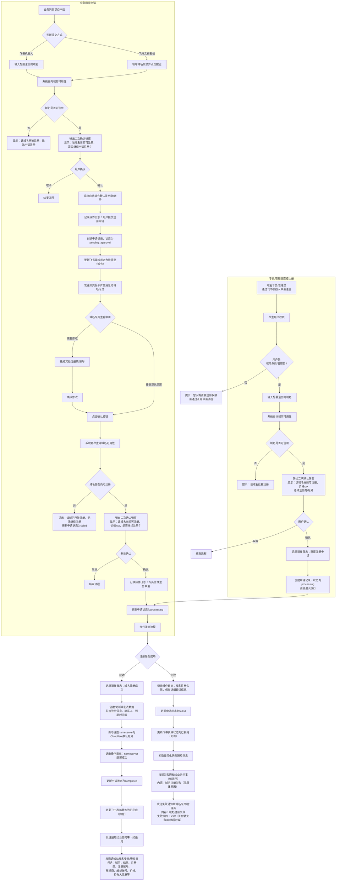
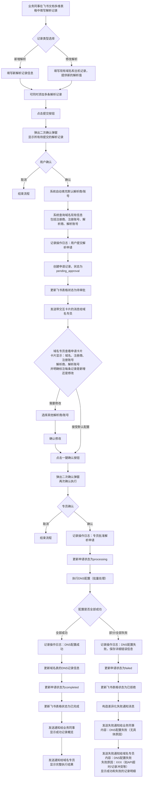
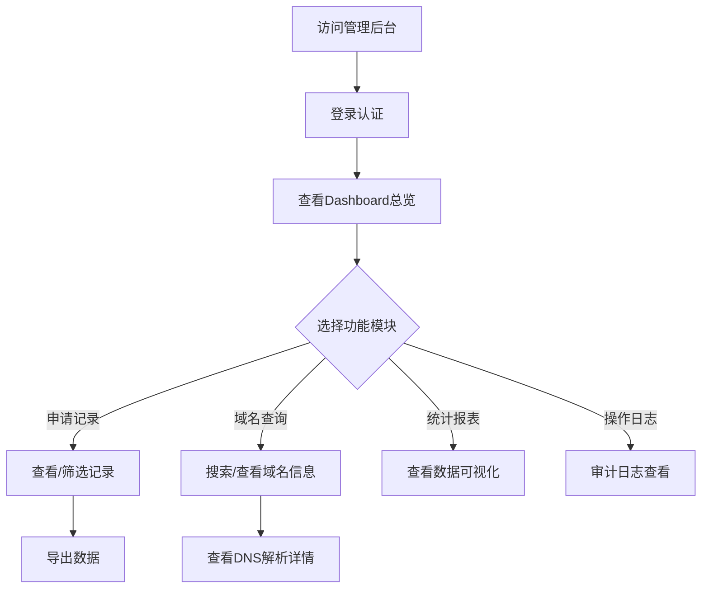
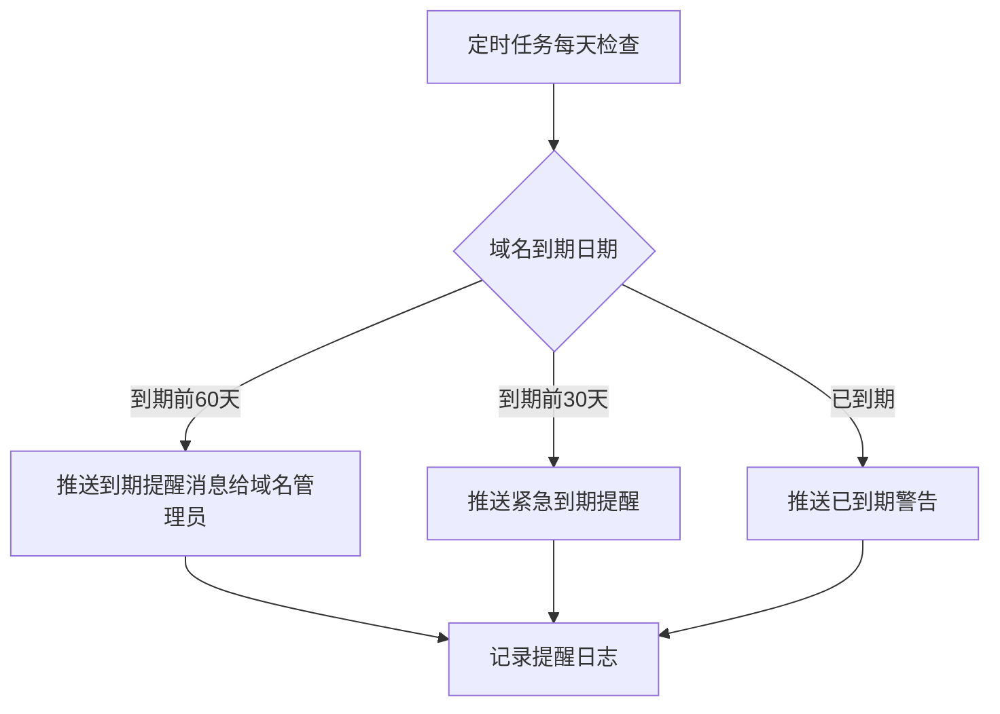

# 域名管家 - 产品需求文档 (PRD)

## 1. Product Overview
企业级域名管理自动化平台，通过飞书机器人提供便捷的域名注册和DNS解析申请审批流程，配备Web管理后台进行记录查看、报表统计和日志分析。

- 解决企业多平台（GoDaddy/Cloudflare等）域名分散管理、审批流程不规范的问题
- 为业务同事提供便捷的自助申请通道，为域名管理员提供统一的管理和审批界面
- **与飞书文档深度集成**：在现有飞书文档的域名章节可直接发起请求

## 2. Core Features

### 2.1 组织关系和权限隔离

#### 组织关系架构
```
系统管理员
  ├── 域名专员1
  │   ├── 注册账号1-1 (GoDaddy)
  │   │   └── 域名A, 域名B, ...
  │   ├── 注册账号1-2 (Namecheap)
  │   │   └── 域名C, 域名D, ...
  │   ├── 解析账号1-1 (Cloudflare)
  │   │   └── 域名A, 域名C, ... (DNS配置)
  │   └── 解析账号1-2 (Cloudflare)
  │       └── 域名B, 域名D, ... (DNS配置)
  │
  └── 域名专员2
      ├── 注册账号2-1 (Cloudflare)
      │   └── 域名E, 域名F, ...
      └── 解析账号2-1 (Cloudflare)
          └── 域名E, 域名F, ... (DNS配置)
```

#### 权限隔离规则
1. **账户隔离**：域名专员只能看到和管理分配给自己的注册账号、解析账号、域名
2. **数据隔离**：Web管理后台中，各域名专员的数据完全隔离
3. **申请隔离**：业务同事提交的申请，只能分配给负责该业务同事的域名专员审批
4. **域名关系**：每个域名有且只有一个注册商账号和一个解析商账号

#### 注册商和解析商支持
- **注册商支持**：Cloudflare (cf)、GoDaddy、Namecheap、Enom
- **解析商支持**：仅Cloudflare (cf)
- **默认配置**：注册成功后自动将域名的nameserver设置为Cloudflare默认账号

#### 域名可用性检查方式

##### 检查策略（已确认方案）

**优先使用 Cloudflare API（完全免费）**：
- 使用 Cloudflare Registrar API 检查域名可用性和价格
- 免费、准确，可直接注册
- 如果Cloudflare无法注册，再考虑其他注册商

**备用方案 RDAP 公共查询（完全免费）**：
- 使用 IANA 提供的公共 RDAP 查询服务
- 用于验证域名的注册信息、到期时间等
- **不推荐**：WHOIS 查询（有隐私保护，数据不准确）

##### 各注册商API说明

| 注册商 | 免费条件 | 可用性检查 | 价格信息 | 建议 |
|-------|---------|-----------|---------|------|
| Cloudflare | ✅ 完全免费 | ✅ 支持 | ✅ 支持 | **首选** |
| GoDaddy | ❌ 需 50+ 域名或 $20+/月 | ✅ 支持 | ✅ 支持 | 仅当满足条件时使用 |
| Namecheap | ❌ 需 $50+ 余额或 20+ 域名 | ✅ 支持 | ✅ 支持 | 仅当满足条件时使用 |
| Enom | 待确认 | 待确认 | 待确认 | 补充调研后确定 |

##### 实施规则
1. **默认配置**：所有注册申请默认使用系统配置的默认注册商和注册账号
2. **手动选择**：域名专员在审批/注册时可手动修改注册商、注册账号、解析商、解析账号
3. **不自动回推**：系统不会根据注册失败自动尝试其他注册商，由专员决定是否更换
4. **查询验证**：对于已有的域名，使用 RDAP 查询验证信息

### 2.2 User Roles
| Role | Registration Method | Web Access | Core Permissions |
|------|---------------------|-------------|------------------|
| 业务同事 | 飞书用户 | ❌ 无Web登录 | 提交域名注册/DNS申请（仅填写域名，不填注册商）、查看自己的申请记录和状态 |
| 域名专员 | 飞书用户（配置） | ✅ Web登录权限 | 审批申请、选择/修改注册商和注册账号、**直接通过飞书机器人申请/注册域名（无需审批）**、查看分配给自己的域名、接收到期提醒 |
| 系统管理员 | Web管理后台 | ✅ Web登录权限 | 所有权限：配置平台账号、配置默认注册商/解析商、配置用户、查看所有记录、管理系统、**直接通过飞书机器人申请/注册域名（无需审批）** |

### 2.2 Feature Module
1. **飞书机器人交互**：自然语言对话式申请、状态查询、快捷命令
   - **直接注册**：域名专员和管理员可通过飞书机器人直接申请并注册域名（无需审批）
   - **申请审批**：业务同事提交的申请仍需审批流程
2. **飞书文档集成**：在飞书文档的域名表格/列表中点击按钮，直接发起请求
3. **申请审批工作流**：
   - **业务同事**：提交申请 → 域名专员审批 → 执行
   - **域名专员/管理员**：直接通过飞书机器人申请注册 → 跳过审批直接执行
4. **Web管理后台**：Dashboard总览、申请记录管理、域名信息查询、统计报表、日志查看
   - **登录权限**：仅域名专员和系统管理员可登录
   - **数据隔离**：域名专员只能查看分配给自己的域名、申请记录
   - **管理员**：查看所有数据
5. **平台集成**：GoDaddy/Cloudflare等域名注册商和DNS平台对接
6. **域名到期提醒**：定时检查域名到期情况，提前2个月自动通知域名专员
7. **系统配置管理**：
   - 域名商配置：配置域名注册商信息
   - 解析商配置：配置DNS解析平台信息
   - 域名账号配置：配置域名注册账号（含key）、分配给专员
   - 解析账号配置：配置DNS解析账号（含key）
   - **默认配置设置**：设置默认注册商、默认注册账号、默认解析商、默认解析账号
   - 用户管理：配置业务人员、域名专员的基本信息、飞书信息、权限

### 2.3 功能约束说明
- **域名信息查询**：仅支持查看域名详情和DNS解析记录，不提供修改或删除功能
- **数据安全性**：所有修改和删除操作必须通过飞书机器人审批流程进行
- **差异化通知**：失败通知时，业务人员只收到失败结果，域名专员收到详细失败原因

### 2.4 Page Details
| Page Name | Module Name | Feature description |
|-----------|-------------|---------------------|
| Web管理后台首页 | Dashboard总览 | 申请总数统计、待审批提醒、状态分布饼图、近期申请列表 |
| 申请记录 | 记录列表 | 支持按状态/时间/申请人筛选，查看详情，支持导出 |
| 申请详情页 | 详情展示 | 完整展示申请信息、审批历史、执行结果、DNS配置 |
| **域名查询** | **域名列表** | **展示所有管理的域名，支持搜索域名、查看基本信息（注册商、到期时间、DNS平台、所属账号、负责专员、联系人信息）** |
| **域名详情** | **DNS解析记录** | **查看域名的完整DNS解析记录，包括A/CNAME/MX/TXT等记录类型（仅查看，禁止修改删除）** |
| **域名到期** | **到期提醒** | **展示即将到期（30天内）和近期到期（60天内）的域名列表** |
| **系统配置 - 域名商** | **域名商管理** | **添加/编辑/删除域名注册商信息** |
| **系统配置 - 解析商** | **解析商管理** | **添加/编辑/删除DNS解析平台信息** |
| **系统配置 - 域名账号** | **域名账号管理** | **配置域名注册账号（含API Key）、分配给域名专员（一个账号只属于一个专员）** |
| **系统配置 - 解析账号** | **解析账号管理** | **配置DNS解析账号（含API Key）** |
| **系统配置 - 默认设置** | **默认配置管理** | **设置系统默认注册商、默认注册账号、默认解析商、默认解析账号** |
| **系统配置 - 用户管理** | **用户管理** | **配置业务人员、域名专员的基本信息、飞书用户ID、权限设置** |
| 统计报表 | 数据可视化 | 按时间/类型/申请人多维度统计，图表展示 |
| 操作日志 | 审计日志 | 系统操作记录、API调用日志、错误日志查看 |

## 3. Core Process

### 3.1 域名注册申请流程


### 3.2 DNS解析申请流程


### 3.3 飞书文档多维表格发起申请流程
```mermaid
flowchart TD
    A[打开飞书文档] --> B[进入域名信息/解析信息章节]
    B --> C[查看嵌入的飞书多维表格]
    C --> D{选择发起的操作}
    D -->|点击"申请注册域名"按钮| E[填写域名信息]
    D -->|点击"申请DNS解析"按钮| F[填写域名和解析记录]
    E --> G[飞书工作流触发：调用API查询域名可用性]
    F --> H[飞书工作流触发：弹出二次确认弹窗]
    G --> I{域名是否可注册}
    I -->|否| J[在飞书表格中显示：该域名已被注册，无法申请注册]
    I -->|是| K[在飞书表格中显示二次确认弹窗<br/>内容：该域名当前可注册，是否继续申请注册？]
    H --> L[用户确认后调用我们的API]
    K --> L
    L --> M[创建申请记录]
    M --> N[更新飞书表格状态为待审批]
    N --> O[通知域名专员审批]
```

### 3.4 Web管理后台使用流程


### 3.5 域名到期提醒流程


## 4. User Interface Design

### 4.1 Design Style
- **主色调**：深蓝色 (#1e40af) 搭配天蓝色 (#3b82f6) 作为辅助色，体现专业可靠
- **按钮风格**：圆角矩形，带轻微阴影，hover有上浮动画
- **字体**：系统默认无衬线字体，标题加粗
- **布局风格**：侧边栏导航 + 卡片式内容区
- **图标风格**：使用线性图标，简洁清晰

### 4.2 Page Design Overview
| Page Name | Module Name | UI Elements |
|-----------|-------------|-------------|
| Dashboard | 统计卡片 | 4-6个数据卡片，显示关键指标，数字动画效果 |
| Dashboard | 图表区域 | 饼图展示状态分布，折线图展示申请趋势 |
| 申请记录 | 表格 | 可筛选、可排序、支持分页的表格组件 |
| **域名查询** | **域名列表卡片** | **支持按注册商/DNS平台筛选，带到期天数标签** |
| **域名详情** | **DNS记录表格** | **按记录类型分组展示，仅展示按钮无操作按钮** |
| **域名到期** | **到期列表** | **颜色标记紧急程度（红色<30天/黄色<60天），显示剩余天数** |
| 统计报表 | 图表 | 多种图表类型选择，时间范围筛选器 |
| 日志页面 | 时间线 | 操作日志按时间轴展示，支持日志级别过滤 |

### 4.3 Responsiveness
- Desktop-first 设计，优化大屏显示
- 侧边栏在小屏设备可折叠
- 表格在移动端转为卡片展示
- 支持触摸操作优化

### 4.4 交互细节
- 页面加载有骨架屏效果
- 数据更新有平滑过渡动画
- 按钮点击有微反馈
- 侧边栏菜单有展开/收起动画

## 5. 飞书文档集成方案

### 5.1 飞书多维表格配置

#### 5.1.1 域名信息表格
| 列名 | 字段类型 | 说明 | 必填 |
|------|----------|------|------|
| 域名 | 多行文本 | 要注册的域名 | 是 |
| 备注 | 多行文本 | 附加说明 | 否 |
| 申请注册 | 按钮 | 点击发起注册申请 | - |
| 申请状态 | 单选 | 待申请/待审批/审批中/已完成/已拒绝 | - |
| 申请人 | 人员 | 自动填充申请人 | - |

#### 5.1.2 解析信息表格（主表）
| 列名 | 字段类型 | 说明 | 必填 |
|------|----------|------|------|
| 申请编号 | 自动编号 | 申请编号，自动生成 | 是 |
| 申请人 | 人员 | 自动填充申请人 | - |
| 申请时间 | 创建时间 | 记录申请时间 | - |
| 申请状态 | 单选 | 待申请/待审批/审批中/已完成/已拒绝 | - |
| 备注 | 多行文本 | 附加说明 | 否 |
| 提交申请 | 按钮 | 点击发起解析申请<br/>（开启确认弹窗） | - |

#### 5.1.3 解析记录明细表（关联表）
| 列名 | 字段类型 | 说明 | 必填 |
|------|----------|------|------|
| 关联申请编号 | 关联字段 | 关联到主表的申请编号 | 是 |
| 域名 | 单行文本 | 域名 | 是 |
| 操作类型 | 单选 | 新增解析/修改解析 | 是 |
| 记录类型 | 单选 | A/AAAA/CNAME/MX/TXT/SRV | 是 |
| 主机记录 | 单行文本 | 如：www/@ | 是 |
| 记录值 | 多行文本 | 解析目标（新值） | 是 |
| 原记录值 | 多行文本 | 修改时必填，原解析目标（原值） | 否 |
| TTL | 数字 | 默认3600 | 否 |
| 优先级 | 数字 | MX/SRV记录必填 | 否 |
| 权重 | 数字 | SRV记录必填 | 否 |
| 端口 | 数字 | SRV记录必填 | 否 |

### 5.2 飞书工作流配置

**触发条件**：当用户点击表格中的按钮时

**执行动作**：
1. 记录当前行数据
2. 调用我们的API（POST /api/feishu/request）
3. 传递参数：
   - `trigger_type`: domain_register 或 dns_record
   - `requester_id`: 飞书用户ID
   - `requester_name`: 飞书用户名
   - `domain`: 域名字段值
   - `dns_records`: DNS记录信息（解析申请时）
   - `table_row_id`: 表格行ID（用于更新状态）

### 5.3 DNS解析新增/修改识别与处理

#### 5.3.1 业务同事填写申请
业务同事在飞书文档的解析信息表格中填写解析记录时：
1. 每个解析记录需要选择操作类型：
   - **新增解析**：填写完整的新解析记录信息
   - **修改解析**：填写现有域名和主机记录，并提供新的解析值和原记录值
2. 支持同时添加多条解析记录（同一申请编号下）
3. 填写完成后点击"提交申请"按钮
4. 系统弹出二次确认弹窗，展示所有待提交的解析记录供业务同事确认

#### 5.3.2 系统智能识别新增/修改
系统收到申请后，自动进行以下处理：
1. 对于标记为「新增解析」的记录：
   - 查询该域名在目标DNS平台是否已存在相同主机记录
   - 如果不存在：识别为真正的新增
   - 如果已存在：标记为「可能需修改」，发送提示信息给域名专员
2. 对于标记为「修改解析」的记录：
   - 查询该域名在目标DNS平台是否存在该主机记录
   - 如果存在且值不同：识别为修改
   - 如果不存在：提示域名专员确认是否改为新增
3. 所有解析记录标记完成后，生成待审批的申请记录

#### 5.3.3 域名专员审批流程
域名专员收到带交互卡片的飞书消息：
1. 卡片展示所有解析记录，**明确标识每条记录是「新增」还是「修改」**：
   - 新增解析：用绿色背景或标签标识
   - 修改解析：用黄色背景或标签标识，同时显示原记录值和新值
2. 卡片顶部显示申请信息（域名、申请人、申请时间等）
3. 卡片底部有两个按钮：
   - **一键确认**：接受所有解析记录的申请（带二次确认弹窗）
   - **查看详情**：跳转到管理后台查看完整信息
4. 点击「一键确认」后，系统再次弹出确认弹窗，展示所有待执行的操作供专员再次确认
5. 确认后系统开始执行DNS配置

#### 5.3.4 执行结果反馈与通知
执行完成后，系统进行以下处理：
1. 记录操作日志，包含每条解析记录的执行结果
2. 更新申请状态为已完成或失败
3. 发送通知消息：
   - **业务同事**：收到简化的成功/失败通知，只显示哪些记录成功、哪些失败，不显示错误详情
   - **域名专员**：收到完整的执行结果通知，包含：
     - 每条解析记录的执行状态
     - 失败记录的详细错误信息
     - 成功记录的当前解析值确认
4. 更新飞书表格中的申请状态

### 5.4 嵌入飞书文档
1. 在飞书文档的"域名信息"章节插入域名信息多维表格
2. 在飞书文档的"解析信息"章节插入解析信息主表和明细表
3. 配置表格的可见权限和编辑权限

## 6. 权限管理方案

### 6.1 用户配置（Web管理后台）
在Web管理后台的"用户管理"中配置所有用户，字段包括：
| 字段 | 说明 | 示例 |
|------|------|------|
| 姓名 | 用户姓名 | 张三 |
| 角色 | business/domain_spec/admin | 业务同事 |
| 飞书用户ID | 必填，用于身份识别和消息发送 | ou_1234567890abcdef |
| 飞书UnionID | 可选，用于跨应用识别 | on_abcdef1234567890 |
| 邮箱 | 可选 | zhangsan@company.com |
| 权限列表 | 多选，控制可访问的功能模块 | 申请域名、查看记录 |

### 6.2 权限控制
- **业务同事**：
  - 可通过飞书机器人或飞书文档表格发起申请
  - 可查看自己的申请记录和状态
  - 可查看域名公开信息（仅查询，无修改权限）
  
- **域名专员**：
  - 所有业务同事权限
  - 可审批申请
  - 可选择/修改注册商和账号
  - 可查看分配给自己的域名账号
  - 可收到到期提醒
  
- **系统管理员**：
  - 所有权限
  - 可配置平台账号
  - 可配置用户和权限
  - 可查看所有记录和报表

### 6.3 身份识别机制
- 用户通过飞书机器人或飞书文档表格发起操作时，系统通过飞书用户ID识别用户身份
- 系统在用户表中查找匹配的 `feishu_userid`
- 如未找到匹配用户，提示用户联系管理员配置
- 如找到用户，根据角色和权限列表判断是否允许操作

## 7. 操作记录系统

### 7.1 需要记录的操作类型

| 操作类型 | 触发场景 | 记录内容 |
|---------|---------|---------|
| 用户提交注册申请 | 业务同事通过飞书机器人或文档提交域名注册申请 | 操作人ID、操作人姓名、域名、提交方式（机器人/表格）、时间戳 |
| 用户提交解析申请 | 业务同事通过飞书机器人或文档提交DNS解析申请 | 操作人ID、操作人姓名、解析记录列表（包含每条记录的域名、操作类型、记录详情）、提交方式、时间戳 |
| 系统识别解析记录 | 系统自动识别新增/修改解析记录 | 申请ID、识别结果（新增/修改）、识别依据、时间戳 |
| 专员批准申请 | 域名专员点击批准按钮 | 操作人ID、操作人姓名、申请ID、选择的注册商/解析商、选择的账号、批准的解析记录列表、时间戳 |
| 专员拒绝申请 | 域名专员点击拒绝按钮 | 操作人ID、操作人姓名、申请ID、拒绝原因、时间戳 |
| 域名注册成功 | 注册流程执行完毕且成功 | 申请ID、域名、注册商、注册账号、价格、注册时间、到期时间、联系人信息、时间戳 |
| 域名注册失败 | 注册流程执行完毕但失败 | 申请ID、域名、注册商、注册账号、错误信息、时间戳 |
| DNS配置成功 | 解析配置流程执行完毕且成功 | 申请ID、成功的解析记录列表（每条记录包含域名、记录类型、主机记录、记录值、执行状态）、解析商、解析账号、时间戳 |
| DNS配置失败 | 解析配置流程执行完毕但失败 | 申请ID、失败的解析记录列表（每条记录包含域名、记录类型、主机记录、记录值、错误信息）、解析商、解析账号、时间戳 |
| 到期提醒发送 | 定时任务发送到期提醒 | 域名、提醒级别（warning/critical）、接收人、时间戳 |
| 系统配置变更 | 管理员修改系统配置 | 操作人ID、操作人姓名、配置项、变更前值、变更后值、时间戳 |

### 7.2 操作日志表结构

| 字段名 | 类型 | 必填 | 说明 |
|--------|------|------|------|
| id | Integer | 是 | 日志ID，自增主键 |
| action_type | String | 是 | 操作类型，如：register_submit, register_approve, register_success, register_fail, dns_submit, dns_approve, dns_success, dns_fail, expire_remind, config_change |
| request_id | String | 否 | 关联的申请ID（如适用） |
| domain | String | 否 | 关联的域名（如适用） |
| operator_id | String | 是 | 操作人ID（系统操作为"system"） |
| operator_name | String | 是 | 操作人姓名（系统操作为"System"） |
| action_details | JSON | 否 | 操作详情，结构化数据 |
| message | Text | 否 | 操作描述或错误信息 |
| created_at | DateTime | 是 | 操作时间戳 |

### 7.3 操作记录查询

- **Web管理后台**：在"操作日志"页面支持按以下条件筛选
  - 时间范围
  - 操作类型
  - 操作人
  - 域名
  - 申请ID
- 支持日志导出功能

## 8. 注册成功后的数据更新

### 8.1 域名表数据更新

注册成功后，系统自动更新`domains`表，包含以下信息：

| 字段 | 数据来源 | 说明 |
|------|---------|------|
| name | 申请时输入 | 域名名称 |
| registrar_id | 选择的注册商 | 注册商ID |
| reg_account_id | 选择的注册账号 | 注册账号ID |
| dns_provider_id | 默认配置或选择的解析商 | DNS解析商ID |
| dns_account_id | 默认配置或选择的解析账号 | DNS解析账号ID |
| registration_date | 注册商API返回 | 域名注册日期 |
| expiration_date | 注册商API返回 | 域名到期日期 |
| created_at | 系统自动生成 | 记录创建时间 |
| updated_at | 系统自动生成 | 记录更新时间 |

### 8.2 域名联系人表数据更新

注册成功后，系统自动创建`domain_contacts`表记录，包含：

| 联系人类型 | 说明 |
|-----------|------|
| registrant | 域名注册人 |
| admin | 管理员联系人 |
| tech | 技术联系人 |
| billing | 账单联系人 |

### 8.3 飞书表格状态同步

如果申请是从飞书文档多维表格发起的，系统会调用飞书API更新表格中的"申请状态"列：

| 状态变更 | 飞书表格列值 |
|---------|-----------|
| 申请创建成功 | 待审批 |
| 专员审批中 | 审批中 |
| 注册/配置成功 | 已完成 |
| 注册/配置失败或被拒绝 | 已拒绝 |

## 9. 通知消息规范

### 9.1 通知差异化策略

#### 9.1.1 成功通知
| 接收者 | 消息内容 | 说明 |
|--------|---------|------|
| 业务同事 | 域名、结果、注册时间 | 不包含敏感信息 |
| 域名专员 | 域名、结果、注册账号、价格、持有人信息等 | 包含完整信息 |

#### 9.1.2 失败通知
| 接收者 | 消息内容 | 说明 |
|--------|---------|------|
| 业务同事 | 域名、失败结果 | **无具体原因**，避免造成困惑 |
| 域名专员 | 域名、失败结果、**详细失败原因** | 包含具体错误信息，便于排查和解决 |

#### 9.1.3 失败原因分类
| 失败类型 | 示例错误信息 | 通知域名专员 |
|---------|-----------|------------|
| 付款失败 | "Payment failed: Credit card declined" | ✅ 包含详细原因 |
| 网络超时 | "Network timeout: Registrar API unreachable" | ✅ 包含详细原因 |
| 域名被抢注 | "Domain already registered by another party" | ✅ 包含详细原因 |
| API错误 | "Registrar API error: Invalid API key" | ✅ 包含详细原因 |
| DNS配置失败 | "DNS API timeout" | ✅ 包含详细原因 |
| 记录冲突 | "DNS record already exists" | ✅ 包含详细原因 |

### 9.2 飞书消息通知能力

#### 9.2.1 支持的消息类型
| 消息类型 | 支持情况 | 说明 |
|---------|---------|------|
| 文本消息 | ✅ | 简单的文字通知 |
| 富文本消息 | ✅ | 支持多级标题、列表、加粗等格式 |
| 卡片消息 | ✅ | 支持交互按钮、标题、内容区块 |
| 批量消息 | ✅ | 支持向多个用户发送相同消息 |

#### 9.2.2 消息发送限制
| 限制项 | 限制值 | 说明 |
|--------|--------|------|
| 单用户发送频率 | 5 QPS | 向同一用户发送消息的限频 |
| 单群组发送频率 | 5 QPS | 向同一群组发送消息的限频 |
| 单应用每日批量消息 | 50万条 | 批量发送消息的总条目数 |

#### 9.2.3 消息内容定制
- ✅ 支持向不同用户发送不同内容的消息
- ✅ 支持使用卡片消息，包含标题、内容、操作按钮
- ✅ 支持引用变量，动态插入域名、时间等信息
- ✅ 支持条件判断，根据成功/失败状态发送不同消息

### 9.3 实现方式

在服务端代码中，根据不同的通知场景构造不同的消息体：

```python
# 失败通知示例
def send_failure_notifications(request, error_details):
    # 构造给业务人员的消息（不含具体原因）
    user_message = f"""
    ❌ 域名注册失败
    
    域名：{request.domain}
    状态：注册失败
    
    请联系域名专员了解详情。
    """
    
    # 构造给域名专员的消息（含详细原因）
    admin_message = f"""
    ❌ 域名注册失败
    
    域名：{request.domain}
    申请人：{request.requester_name}
    状态：注册失败
    
    失败原因：{error_details['reason']}
    错误代码：{error_details['code']}
    建议操作：{error_details['suggestion']}
    
    请及时处理！
    """
    
    # 分别发送消息
    send_message_to_user(request.requester_id, user_message)
    send_message_to_admin(request.admin_id, admin_message)
```

## 10. 技术可行性确认

### 10.1 飞书功能支持情况

| 功能需求 | 飞书支持情况 | 确认依据 |
|---------|------------|---------|
| 域名可用性查询 | ✅ 可通过注册商API实现 | 各注册商提供域名查询接口 |
| 多维表格确认弹窗 | ✅ 完全支持 | 按钮字段支持开启"确认弹窗" |
| 卡片消息二次确认弹窗 | ✅ 支持 | 按钮组件支持 `confirm` 字段 |
| 交互卡片消息 | ✅ 支持 | 飞书卡片消息支持交互按钮 |
| 差异化消息内容 | ✅ 支持 | 服务端可构造不同消息体发送给不同用户 |
| 发送给指定用户 | ✅ 支持 | 通过open_id/union_id/user_id指定接收者 |
| 消息内容定制 | ✅ 支持 | 支持文本、富文本、卡片等多种消息类型 |
| 更新多维表格状态 | ✅ 支持 | 通过飞书API可更新表格字段 |
| 定时任务 | ✅ 可通过服务端实现 | APScheduler等工具支持 |

### 10.2 弹窗确认功能详解

#### 10.2.1 飞书多维表格按钮确认弹窗

**适用场景**：业务同事通过飞书文档提交申请时的确认

**实现方式**：
1. 在多维表格中创建按钮字段（如"申请注册域名"）
2. 配置按钮时勾选"开启确认弹窗"
3. 设置弹窗标题和内容
4. 用户点击按钮后，会先弹出确认框，用户确认后才触发工作流

**配置示例**：
- 弹窗标题：确认申请注册域名
- 弹窗内容：该域名当前可注册，是否继续申请注册？
- 确认按钮文字：确认申请

**官方文档说明**：
> （可选）勾选 开启"确认弹窗" 并设置弹窗标题、内容及确认按钮显示的文字。勾选后，协作者点击按钮后需要在弹窗中确认操作。

#### 10.2.2 飞书卡片消息二次确认弹窗

**适用场景**：域名专员审批时确认注册操作的二次确认

**实现方式**：通过卡片消息按钮的 `confirm` 字段实现

**JSON配置示例**：
```json
{
  "tag": "button",
  "element_id": "confirm_register",
  "type": "primary",
  "text": {
    "tag": "plain_text",
    "content": "确认注册"
  },
  "confirm": {
    "title": {
      "tag": "plain_text",
      "content": "确认域名注册"
    },
    "text": {
      "tag": "plain_text",
      "content": "该域名当前可注册\n价格：¥50/年\n是否确认注册？"
    }
  }
}
```

**交互效果**：
- 专员点击"确认注册"按钮
- 弹出二次确认弹窗显示价格等信息
- 专员再次确认后才执行注册操作

#### 10.2.3 两种弹窗的对比

| 对比项 | 多维表格确认弹窗 | 卡片消息二次确认弹窗 |
|--------|----------------|-------------------|
| 触发时机 | 用户提交申请时 | 专员审批确认时 |
| 配置位置 | 多维表格字段设置 | 卡片消息JSON配置 |
| 弹窗内容 | 静态配置 | 可动态插入域名、价格等信息 |
| 适用对象 | 业务同事 | 域名专员 |

### 10.3 结论

**所有需求功能在技术层面均可实现，飞书平台提供的能力完全满足系统设计要求。**

特别是弹窗确认功能：
- ✅ **多维表格按钮确认弹窗** - 用于用户提交申请时的首次确认
- ✅ **卡片消息二次确认弹窗** - 用于域名专员审批时的最终确认
